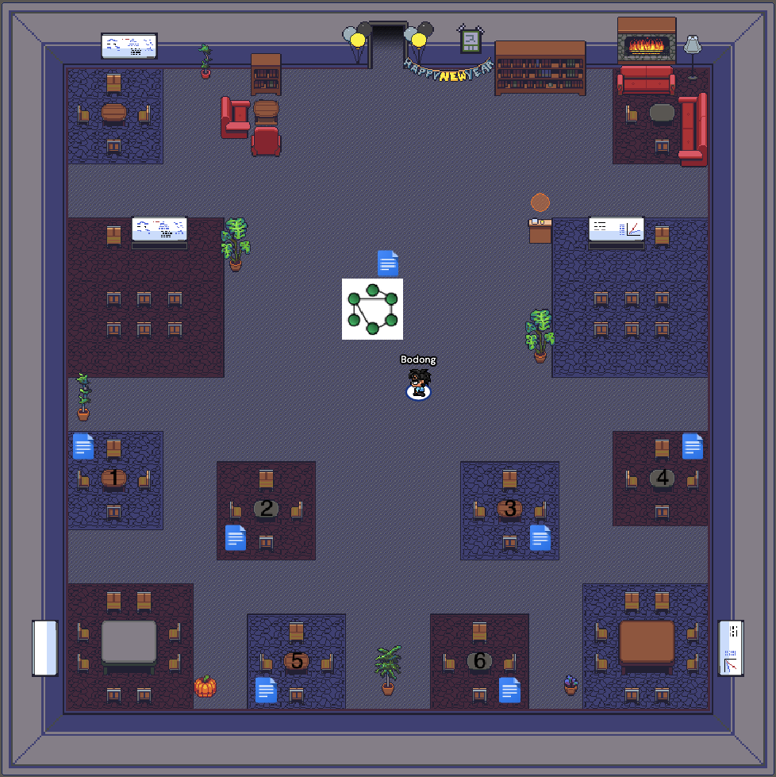

# Introduction {#intro}

This week we will: 

1. Get to know each other
2. Walk through the Syllabus, and get to know course logistics
3. Read and discuss introductory articles

<iframe width="560" height="315" src="https://www.youtube-nocookie.com/embed/_FfL-2K4hbI" frameborder="0" allow="accelerometer; autoplay; clipboard-write; encrypted-media; gyroscope; picture-in-picture" allowfullscreen></iframe>

<!-- <iframe width="640" height="360" src="https://www.youtube.com/embed/JvgqCZtLtp0?rel=0" frameborder="0" allowfullscreen></iframe> -->

<!-- Please click on the '>' button to proceed to the next page. -->

<!-- <iframe src="https://h5p.org/h5p/embed/1405" width="1090" height="377" frameborder="0" allowfullscreen="allowfullscreen"></iframe> -->

<!-- <iframe src="https://h5p.org/h5p/embed/53171" width="1117" height="2675" frameborder="0" allowfullscreen="allowfullscreen"></iframe> -->

## What is Social Network Analysis?

### A light intro video made by colleagues from Duke.

<iframe width="640" height="360" src="https://www.youtube.com/embed/xT3EpF2EsbQ?list=PL1M5TsfDV6Vs7tnHGNgowEUwJW-O8QVp5" frameborder="0" allowfullscreen></iframe>

[Credit: ModU: Powerful Concepts in Social Science](https://www.youtube.com/channel/UCDfHkEuoKb_TXYkQY6BkIIg)

### A deeper dive: The hidden influence of social networks

<iframe width="560" height="315" src="https://www.youtube.com/embed/2U-tOghblfE" frameborder="0" allowfullscreen></iframe>

## Networks are everywhere!

We come together to learn (more) about social network analysis (SNA) – for various reasons and from various disciplinary angles. 

In preparation for the class, post your initial ideas of using SNA below, by clicking on the **+** button.

<iframe src="https://padlet.com/embed/vcxyk6btrux9sc32" frameborder="0" allow="camera;microphone;geolocation" style="width:100%;height:608px;display:block;padding:0;margin:0"></iframe>

<!-- ### Bodong's SNA journey -->

<!-- I myself was first exposed to SNA in 2007, when there was a distance class offered at Peking University (where I completed my master's) in collaboration with another university in the Netherlands. Looking backwards, I don't think I've learned much from that class, mostly because I didn't see a clear relevance between my work then and SNA.  -->
<!-- During my doctoral studies in Toronto, I became increasingly intrigued by SNA (and network analysis in general), because 1) the world is becomming increasingly inter-connected; 2) many researchers I read use SNA in many cool ways; and 3) SNA could offer insights to improve learning and teaching. So since then, I've been self-teaching myself about SNA, with help from a vast body of online resources. It has been a long journey with a lot of exploration and tinkering, which I absolutely enjoyed.  -->

<!-- Now I engage with SNA for three major reasons: 1) to apply 'classic' SNA techniques in my empirical work; 2) to develop formative feedback tools focusing on social aspects of learning; and 3) to develop network-based approaches to uncover holistic insights about learning, by combining multiple analytical aspects (social, temporal, semantic) together. I consider myself constantly learning new thigns about SNA, and look forward to this learning journey with everyone in the class! -->

## Week 1 Activities {#week1assign}

Below are a list of activities for Week 1. I strongly encourage you to get started as early as possible!

### Read the Syllabus

The most <a href="https://docs.google.com/document/d/1Z39J9Hn-qn2iKcrVzpMz3nm60ThnGKZMZQ_cWJSlUOg/edit?usp=sharing" target="_blank">current syllabus</a> will always available online. 

In Week 1, please read the Syllabus in full. Ask any questions you may have on the `#questions` Slack channel or leave a comment in the syllabus. 

### Get to know each other

Say hi👋 to the class by posting a short self-introduction on Slack. Things you could include: your (preferred) name and pronouns, your department and program area, why you're taking the class, and one interesting/boring thing about yourself.

### Read and Annotate

**Read** and **annotate** the following texts

- [Carolan, ch. 1](http://methods.sagepub.com.ezp1.lib.umn.edu/book/social-network-analysis-and-education/n1.xml)
- Borgatti et al. [-@Borgatti2009-du]. [Network analysis in the social sciences](http://science.sciencemag.org.ezp2.lib.umn.edu/content/323/5916/892.full). Science, 323(5916), 892–895.  (Note: enter [here](http://science.sciencemag.org/content/323/5916/892.full) if you're a non-UMN participant.)

When annotating, please try to do at least one entry for each of the following:

- Annotate **an SNA term** you find interesting/useful, and provide a definition. Use tag `term` in your annotation
- Annotate **an example application** of SNA in readings, and explain how you find it useful or interesting. Use tags `application` in your annotation
- **Reply to annotations** made by other participants

### Meet the Class on Gather

As mentioned in *Preface*, we will use Gather instead of Zoom. I have created a dedicated virtual classroom for us to mingle. Below is a screenshot of the space. The link to the space will be shared in a calendar invite.

See you on **Tuesday, January 26, 2021, 3--4:30pm** Central Time. 

Have a wonderful week! 
