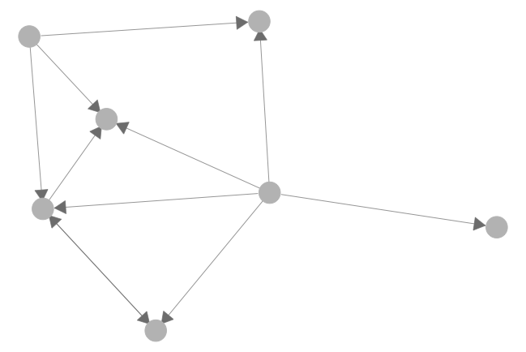
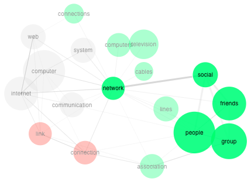

# Basic Concepts {#ch2}

You've done an absolutely wonderful job on Flipgrid and Hypothesis! Each of you brings very unique interests and expertise to the community. I am excited about learning *with* and *from* you in the world of SNA!

### Our interaction network on Hypothes.is {-}

Your contributions on Hypothes.is have been very thoughtful in so many ways. You introduced domain knowledge (e.g., about families) to contexualize our shared texts. You asked important questions. You took time to search for terms and share what you found via annotations. Keep up with your good work!

Based on our social interactions on Hypothes.is, I constructed a simply network visualization below. In the visualization below, each node represents one of us, and each *directed* edge represents the existence of at least one reply. So far 7 colleagues in our communities have connected during the first week. In Week 2, I believe 1) more colleagues will join the conversation, 2) there will be more back-and-forth dialogues (or increased *reciprocity* in SNA terms), and 3) we will have a denser network. Will we be able to conquer these goals?



In terms of specific learning goals, **in this week, we will:**

1. Explore social network perspectives
2. Become familiar with basic SNA concepts
3. Start to draft an initial SNA project idea
            
<!-- <iframe width="640" height="360" src="https://www.youtube.com/embed/lX0SmpoHMNA?rel=0" frameborder="0" allowfullscreen></iframe> -->

## Understanding SNA in Educational Research

<iframe width="640" height="360" src="https://www.youtube.com/embed/jXxpgQAYfTE?list=PLjwvT6cNsD_12ghorqyZ1LHjdvmEhm6N-" frameborder="0" allowfullscreen></iframe>

### Three levels of considerations {#three-levels}

In the previous video, I described three levels of considerations that educational researchers often need to be aware of. You could find more information in text such as [@Niglas2010-tr] or some other research methodology courses. Please note that this framework was *constructed* to help us grapple with the complex terrain of research, and it is highly debatable. 

Below, I try to re-iterate the key message of the video -- but from the bottom up:

- **m**, or methods/techniques: The "small *m*" in SNA constitutes methods or techniques we apply in SNA research. Imagine we are using SNA to investigate friendship of a network of high-schoolers (think about "Gossip Girls" if you've watched that TV series). A technique in this SNA research could be a questionnaire used to collect friendship data among students; it could be the [force-directed layout](https://en.wikipedia.org/wiki/Force-directed_graph_drawing) we use to visualize this network; it could be the measure of *betweenness centrality* we use to characterize high-schoolers; it could also be a network modeling algorithm we apply to model the flow of gossips. In a nutshell, these techniques are more about **what** we concretely do in an SNA research.

- **M**: When SNA is referred to as a "big *M*" Methodology, it is treated as a systematic approach of investigating a phenomenon. Beyond simply applying these techniques, a methodology is also concerned with **why** a technique gets used. In other words, understanding SNA as a methodology means learning to make informed decisions in any stage of an SNA project. For example, why using a questionnaire instead of observations or interviews? In which cases should one use a *circle layout* instead of a force-directed layout? Why a specific SNA measure is appropriate for addressing a research question? In a nutshell, the big *M* is concerned with **how** knowledge could be best gained by following many SNA methodologists and researchers have created so far. 

- **P**, worldviews, philosophical schools of thoughts, paradigms: In SNA, some scholars go further to argue SNA offers a unique way of "seeing the world." In Carolan (2014) chapter 2 you will read about the **relational perspective** that represent a particular worldview that emphasizes relations instead of attributes. You will also read about **relational realism** that is referred to as an ontology grounding SNA. To a great extent, SNA offers a new research paradigm. As put by Barry Wellman, a guru in SNA from the University of Toronto, "It is a comprehensive paradigmatic way of taking social structure seriously by studying directly how patterns of ties allocate resources in a social system" (see, Carolan, 2014, p. 33).

In this course, we are mostly concerned with the "big M" level. We will not dive too deep into the **P** level, and we will not settle with specific techniques. Together, we will learn how to apply various techniques to systematically produce knowledge about a phenomenon.

## Basic Concepts

Last week, you've identified a wide range of terms from course readings. Thanks to many of you who contributed your definitions of important terms. See the Hypothes.is search results below:

```{r, echo=FALSE}
knitr::include_url("https://hypothes.is/groups/REimiBzy/snaed-2019?q=tag%3Aterm", 
  height = "400px")
```

This week, we will be immersed in a number of key SNA concepts. In the following video, I "glide over" some basic terms that are often used in SNA. You do not need to memorize them all. As a matter of fact, I see those terms existing as a network (see the image below); as you "unlock" one term, you are also activating others. So spend time on some terms, and you're implicitly learning about others.

<iframe width="640" height="360" src="https://www.youtube.com/embed/lB5zx3L1Mi4?rel=0" frameborder="0" allowfullscreen></iframe>

  
(Credit: [Small World of Words project](https://smallworldofwords.org/en/project/visualize))

## Week 2 Activities

**Due by Feb 4, 11:59PM**

### Read & Annotate

**Read**:

- [Carolan, ch. 2](http://methods.sagepub.com.ezp1.lib.umn.edu/book/social-network-analysis-and-education/n2.xml), starting from "The Integration of Theory and Method" (pp. 32--42)
- [Carolan, ch. 3](http://methods.sagepub.com.ezp1.lib.umn.edu/book/social-network-analysis-and-education/n3.xml)

Pro Tip:

- Please use the links I provided below (i.e., with `.ezp1.lib.umn.edu`). Please also annotate the webpage directly instead of PDFs. Otherwise, our annotations/convos may get scattered among different pages.

**Annotate** using Hypothes.is. Even though I do not require you to make a specific number of annotations, I encourage you to accomplish the following **"ABC"** this week:

1. **Ask a question**
2. **Brag about your understanding** about an SNA term, a domain-specific theory, a cool tool, etc.
3. When you reply to one peer, **Connect another peer's ideas** in your annotation


### Start to put together an intial project idea

<!-- <iframe width="640" height="360" src="https://www.youtube.com/embed/Pe80-YWFetE?rel=0" frameborder="0" allowfullscreen></iframe> -->

From your Flipgrid videos, I see most of you already having fascinating project ideas. Even though we are only in Week 2, I encourge you to take your ideas to the next level when you engage with our readings and annotations. 

Specifically, you can consider the following: (1) what is the central **problem** of your research and why it is worth investigating, (2) what **phenomenon** you are studying, in which **context**, and what key **question(s)** you have about the phenomenon, and (3) why SNA is potentially fruitful based on your current understanding. 

We will share out our initial project ideas by the end of Week 4.

Have a wonderful week!
