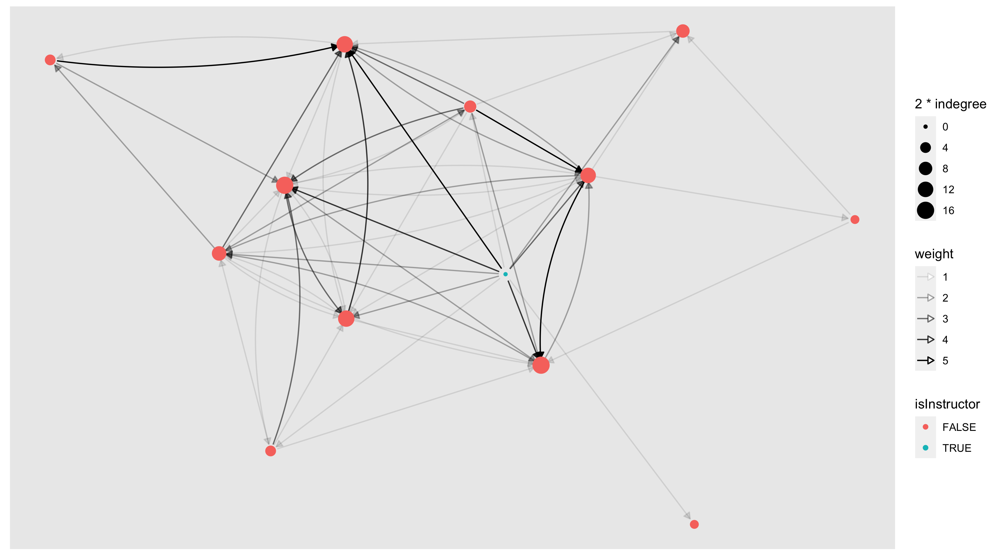
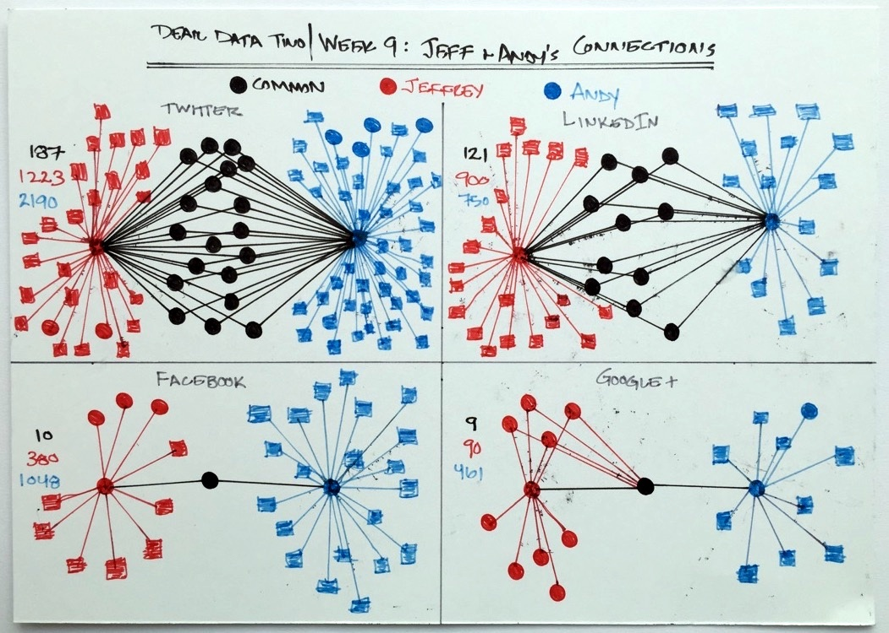

# Applications and Examples I {#ch3}

Thank you all for the engaged conversations. You've done a wonderful job on Hypothesis -- ask thoughtful questions, "bragging" about your understanding, and connecting each other's ideas (aka. doing **ABC** in our collaborative annotations)!  Below is a visualization of our interactions on Hypothesis so far in this course.

This network visualization is slightly more complex than the one you create in [Lab 1](#lab1). I used a node-level measure named *indegree* to scale the size of each node and an edge attribute named *weight* to scale the width of each edge. In other words, the bigger a node is, the more replies this person has received; the thicker an edge is, the more replies it represents. I also colored the instructor (myself) in blue, and it is helpful for me to see my replies reaching most members of our class community. 

**What observations can you make based on the visualization?**

Also, Chen shared several interesting network visualizations from the **[Dear Data](http://www.dear-data-two.com/#Week9)** project. I can't help thinking about artistic representations of networks. 

I look forward to seeing results of your tinkering with [Lab 1](#lab1). Simona has started an `r_support` Slack channel and please feel free to join if you're interested in troubleshooting R together. We get this!

**In this week, we will:**

- Examine some concrete examples of SNA research
- 'Present' an example of your choice to the class
- 'Take' ideas from each other to inform your project ideas

<!-- <iframe width="640" height="360" src="https://www.youtube.com/embed/AuQOlRQ5mCY?rel=0" frameborder="0" allowfullscreen></iframe> -->

## Applications and Examples of SNA

After the first two weeks of exploration, I am quite sure we've come to a share recognition on **the potential of SNA** in various domains. In this page, I want to share two applications of SNA -- outside of education -- that I found inspiring.

The first example is **Suzanne Simard's TED talk on "How trees talk to each other"** that I stumbled upon when listening to NPR. (Canadian accent alert!) The reason I picked this exmaple is Simard's work demonstrates a *paradigm shift* (discussed by Barry Wellman in last week's readings) in the study of trees and forests by highlighting the importance of *ties* among trees.

*Pro Tip*: You can adjust the speed of Youtube videos by clicking on the gear icon at the bottom of the video player.

<iframe width="640" height="360" src="https://www.youtube.com/embed/Un2yBgIAxYs?list=PLSKPwgliCYKuVEJcuhEy7NcKHrYIuS7Yo" frameborder="0" allowfullscreen></iframe>

The second example is Amar Dhand's work on "**stroke patients' health behaviors**" that is based on a specific type of social network named *ego-networks*. The reason I picked this example is Dhand did a great job presenting the motivation of their work and went on to investigate a solution powered by SNA. This presentation could be a great model for you to follow for this week's class activity (see below for details).

<iframe width="640" height="360" src="https://www.youtube.com/embed/4WOGwRQWyNM?list=PL6XFeulyPj7BcB6gLLQyuDkZqWhAeSwQL" frameborder="0" allowfullscreen></iframe>

Did you find these examples inspiring? Feel free to share your thoughts on the `2021-general` Slack channel.

## Week 3 Activities

<!-- - **Read & Share**, due by **Friday Feb 8, 11:59PM** -->
<!-- - **Take / comment**, due by **Monday Feb 11, 11:59PM** -->

### Read & Share

1) **Skim** [Carolan, ch. 10, on "Social Capital"](http://methods.sagepub.com.ezp1.lib.umn.edu/book/social-network-analysis-and-education/n10.xml), and annotate concepts you recognize / don't know

2) **Closely examine** an empirical study of your choice. You could either (*a*) **claim** one article from below -- by annotating it using Hypothesis, or (*b*) **search** for one article from your research area.  I would highly recommend option (*b*) so that this reading activity is adding to your project. [Google Scholar](https://scholar.google.com/) is your friend if you are relatively new to literature search.

When examining the article, please try to discern those three levels of considerations I presented in Week 2 (i.e., Philosophical, Methodological, and methods). 

Below is a list of articles I've compiled in case you want some inspirations.

- Daly, A. J., & Finnigan, K. S. (2011). The Ebb and Flow of Social Network Ties Between District Leaders Under High-Stakes Accountability. American Educational Research Journal, 48(1), 39–79.
- Stadtfeld, C., Vörös, A., Elmer, T., Boda, Z., & Raabe, I. J. (2019). Integration in emerging social networks explains academic failure and success. Proceedings of the National Academy of Sciences, 116(3), 792–797. https://doi.org/10.1073/pnas.1811388115
- Baker-Doyle, K. (2010). Beyond the Labor Market Paradigm: A Social Network Perspective on Teacher Recruitment and Retention. Education Policy Analysis Archives, 18, 26.
- Heck, R. h., Price, C. l., & Thomas, S. l. (2004). Tracks as Emergent Structures: A Network Analysis of Student Differentiation in a High School. American Journal of Education , 110(4), 321–353.
- González Canché, M. S., & Rios-Aguilar, C. (2015). Critical Social Network Analysis in Community Colleges: Peer Effects and Credit Attainment. New Directions for Institutional Research, 2014(163), 75–91. https://doi.org/10.1002/ir.20087
- Hill, M. (2002). Network Assessments and Diagrams: A Flexible Friend for Social Work Practice and Education. Journal of Social Work , 2(2), 233–254.
- Christley, R. M. (2005). Infection in Social Networks: Using Network Analysis to Identify High-Risk Individuals. American Journal of Epidemiology, 162(10), 1024–1031. http://doi.org/10.1093/aje/kwi308
- Christakis, N. A., & Fowler, J. H. (2007). The spread of obesity in a large social network over 32 years. The New England Journal of Medicine, 357(4), 370–379.
- Dawson, S., Tan, J. P. L., & McWilliam, E. (2011). Measuring creative potential: Using social network analysis to monitor a learners’ creative capacity. Australasian Journal of Educational Technology, 27(6), 924–942.
- Honeycutt, T. (2009). Making Connections: Using Social Network Analysis for Program Evaluation. Mathematica Policy Research, (1), 1–4.
- Rienties, B., Héliot, Y., & Jindal-Snape, D. (2013). Understanding social learning relations of international students in a large classroom using social network analysis. Higher Education, 66(4), 489–504. http://doi.org/10.1007/s10734-013-9617-9
- Martinez, A., Dimitriadis, Y., Rubia, B., Gómez, E., & de la Fuente, P. (2003). Combining qualitative evaluation and social network analysis for the study of classroom social interactions. Computers & Education, 41(4), 353–368.
- Roberson, Q. M., & Colquitt, J. A. (2005). Shared and Configural Justice: A Social Network Model of Justice in Teams. Academy of Management Review. Academy of Management, 30(3), 595–607.

### Share & Take

1) **Share** the article you read in a succinct manner to the class. The video on "stroke patients" in the previous page could be a great example to follow. In your sharing, you are suggested to cover:

- research problem/questions
- collection of SNA data
- specific use of SNA (e.g., specific SNA measures, visualizations)
- key findings
- one "praise" (what the authors have done well) and/or one "push" (what the authors could have done better)

You can choose between these **two formats** when you share your analysis with the class:

- *a screencast* (5-min max): A video presentation of you talking through your example. Post a link to your video to the Slack `2021-general` channel. Potential video capturing tools include Zoom, QuickTime, and Screencast-O-Matic.
- *a Slack post* (500-word max): Post a text-based post to the Slack `2021-general` channel as we did in Week 2. You can insert images if needed.

2) **Take** ideas from each other's presentations to inform your project as you continue to craft your project ideas.  **Comment** on each other's posts to acknowledge ideas you take from them, seek clarifications, etc. 

**Important notice: Please strive to share your analysis by Monday 5pm, so that the class community can read/watch each other's contributions on Tuesday.**

### Continue to work on Lab 1

See details posted in [Week 2](#lab1).

### Optional Meetup in Gather

On Tuesday, Feb 9, 3-4pm, I will host a meetup in Gather for those of you who wish to talk with me individually or for you to hang out with each other. Your participation is totally voluntary! 

This meetup would be a great opportunity for us to trouble-shoot your R/RStudio setup if needed. 

Have a wonderful week!
