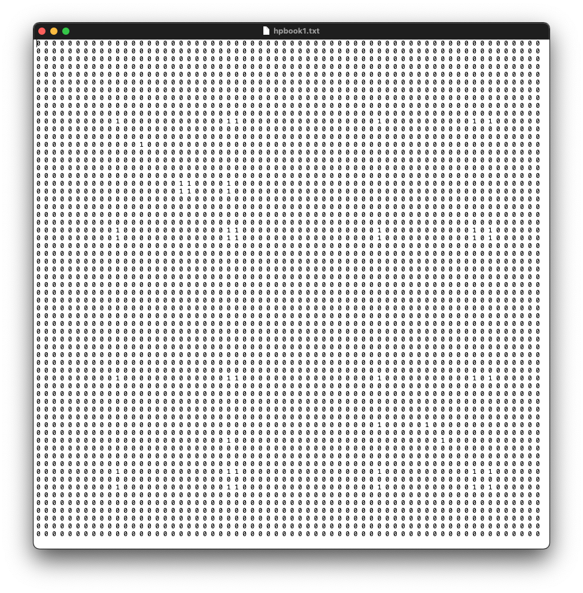

# Collect and Manage Network Data {#ch4}

**In this week, we will:**

- Get to know some key decisions SNA researchers need to make on data collection
- Understand several data collection techniques
- Understand processes involved in storage and transformation of SNA data
- Practice importing data into SNA software
- Become aware of ethical issues involved in SNA research


## Understanding SNA Data {#understanding-sna-data}

Blankly speaking, data collection in SNA research is concerned with two types of data: (1) **relational data** that describe *ties*, and (2) **attribute data** that describe *nodes*. For example, if I want to study friendship in a high school class, depending on my research questions I may choose to collect attribute data of each student (such as gender, race, GPA), and relational data of every possible pair of students (such as whether Student A texts Student B, or how many times A texts B). Quite simple, right?

However, real-world SNA projects in education demand a number of critical decisions to be made by the researcher. Just to list a few examples:

- how to gain access to the research "field" (e.g., a student fraternity, an intimate parent group)
- from whom are data collected (and who are excluded from data collection)
- which instruments are used for data collection
- how are data structured and stored
- how to transform data to different "shapes" to address specific research questions

In this week's reading -- **Carolan (2014), Ch 4** -- you will read detailed suggestions from the author. Below I briefly comment on **a few key points**, before engaging you in detailed techniques in later sections.

### Sources of SNA data

SNA data may be obtained in a variety of ways---from historical archives, questionnaires, ethnographic studies, system logs of online platforms, Medicaid claims, etc. For example, from public records researchers could analyze *co-sponsorship of legislation* in the U.S. Senate [@brandenberger2018trading]; from a classic Chinese novel, *[Dream of the Red Chamber](https://en.wikipedia.org/wiki/Dream_of_the_Red_Chamber)*, researchers could use SNA to estimate relationships between characters based on their co-occurrence [@Zhao2016-th]. In these two cases, we can see that in SNA research some *relational data* are **natural** or readily available (e.g., co-sponsoring of a legislature), while some other need to be **derived** (e.g., relationship between novel characters based on the co-occurrence of names in a same sentence). 

No matter how relational data get gathered or derived, I want to emphasize the importance of **making sound justification** on the collection/creation of relational data. For example, I reviewed a manuscript that analyzed "co-location networks" based on students' simultaneous access to wifi hotspots on a university campus. As a critical reviewer, I would pay special attention to any strong claims made on "social" connections among students, because accessing a same wifi hotspot does not imply any social interaction. However, if the study looks at pairs of students simultaneously accessing 10 hotspots on the campus every day, it would become a totally different story as such intense co-location could be an indicator of (potential) social ties. Therefore, in SNA studies we need to constantly reflect on the **contextual definition(s)** of *ties* and the **operationalization of the definitions** in data collection.

### Totality and sampling

In some cases, we are able to collect a **whole** social network. Imagine [the year-long NASA simulation of a Mars mission in an isolated dome](https://www.theguardian.com/science/2016/aug/28/mars-scientists-nasa-dome-hawaii-mountain-isolation), researchers would have a better chance of studying the social network of all six scientists in its totality.[^1] In other cases, when it becomes impossible to study a whole network (e.g., terrorist networks), researchers will need to apply specific techniques of **sampling**.

[^1]: Whether researchers can investigate a phenomenon in its totality is a philosophical question. But if we focus on highly specified questions (e.g., whether scientists cooperate in an experiment), we can argue the phenomenon is observable and the likelihood of studying this phenomenon in its totality is very high.

As you will read this week, **sampling in SNA research is different from sampling we commonly discuss** in an introductory research methods course. This is because SNA research is concerned with both the *nodes* and the *ties*. Simply put, a representative sample of nodes does not naturally guarantee a meaningful sample of ties. SNA researchers need to be especially aware of the impact of sampling on relational data. For example, in a study we may *systematically sample* every 5th student from a school based on student IDs (sampling applied on nodes), and we may also ask each student to name up to 3 friends in this school (sampling applied on ties). Ego-network also implies an interesting sampling mechanism, as it cares about a focal ego and the nodes to whom the ego is directly connected to plus the ties. This could be intuitively understood by sampling based on *distance* from the ego.

How we sample nodes and/or ties depends on how we **specify the boundaries of networks**. The definition of network boundaries is highly critical for any SNA research and requires systematic considerations on research questions, theoretical perspectives, availability of data, etc. To quote @Scott2012-fq:

> ... the determination of network boundaries is not simply a matter of identifying the apparently natural or obvious boundaries of the situation under investigation. Although 'natural' boundaries may, indeed, exist, **the determination of boundaries in a research project is the outcome of a theoretically informed decision** about what is significant in the situation under investigation... Researchers are involved in a process of conceptual elaboration and model building, not a simple process of collecting pre-formed data (pp. 44-45)

This important recognition speaks back to my Week 1 video on the importance of **learning to make decisions** in such a research methodology class. Defining the boundaries of networks is certainly the most central decision for an SNA project. When we start to inspect these decisions, it may looks like we're opening **"a can of worms"**, as many decisions may look artificial, or slippery at best. In this class, I hope we see decision points as **"a bag of diamonds"**---each worth staring at from different angles.[^2]

[^2]: I enjoy the analogy I'm making here :)

## Ethics in SNA research

Ethical considerations are important for both research and practice. You've already rightfully brought up this topic in prior discussions. We won't spent much time on this topic this week, but I want to encourage you to attend to ethical concerns in your specific research contexts. Does your research involve venerable populations (e.g., young children)? Does your research involve sensitive data (e.g., health data)? Is your research field online or offline? Because SNA is applied in all kinds of educational or organizational settings, it is almost impossible to come up with a unified ethics guideline. **I strongly encourage you to skim this [chapter from an Open Textbook](https://open.lib.umn.edu/principlesmanagement/chapter/9-5-ethical-considerations-with-social-network-analysis/)** produced by the UMN Libraries. What are the possible ethical concerns in your project? I encourage you to start taking notes on how you could address them.

I also want to mention that research ethics is never a static topic at all. In many emerging research spaces (e.g., social media), research ethics remains highly debatable [@Rivers2014-wt;@Kraut2004-se]. Feel free to share your thoughts via Hypothesis by adding the `ethics` hashtag, or in the Slack `general` channel.

If you're a UMN student and wish to conduct an actual SNA project as part of the class project (which is not required), please check this [UMN IRB website](https://research.umn.edu/units/irb) for further information. 


## Linear algebra basics

(You can skip this section if you're already familiar with linear algebra.)

**Matrix is all you need to know at this point.** This class will focus on mathematical intuitions and let the computer do heavy-lifting computations for us.

If you need a quick refresher, check out this video on **matrix**:

<iframe width="560" height="315" src="https://www.youtube.com/embed/0oGJTQCy4cQ?list=PLjwvT6cNsD_12ghorqyZ1LHjdvmEhm6N-" frameborder="0" allowfullscreen></iframe>

If you want to dive deeper in linear algebra, start from this intro video and move onto its learning sequence. Again, you don't need to watch them all and we will introduce mathematical concepts later when necessary.

<iframe width="560" height="315" src="https://www.youtube.com/embed/kjBOesZCoqc?list=PLjwvT6cNsD_12ghorqyZ1LHjdvmEhm6N-" frameborder="0" allowfullscreen></iframe>


## Managing SNA data

In this section, I introduce recommended ways of structuring and handling SNA data. Here I especially consider principles of **tidy data** [@Wickham2014-jr], which may question things you encounter in textbooks. The principles of tidy data are very simple (p. 4), and I will explain each principle below with examples.

1. Each variable forms a column.
2. Each observation forms a row.
3. Each type of observational unit forms a table.

### Basic representations

Note that SNA data typically include **attribute data** about nodes and **relational data** about edges. So the most straightforward way to represent a network is to have two separate tables. 

For example, consider a student group with four students (**nodes**). Table 1 contains attribute data of each student. This table is *tidy* because each variable form a column, each observation (i.e., student) form a row, and it contains a single observational unit `student`. 
<!-- The third principle gets violated, for example, if you add students' yearly `test score` -- another observational unit -- into this table. -->

| name | gender | age |
|:-----|:-------|:----|
| A    | F      | 15  |
| B    | M      | 14  |
| C    | M      | 13  |
| D    | F      | 14  |

:  Table 1. A table of nodes.

Table 2 describes book lending activities (**ties**) among students. For example, Row 1 means Student A lent one book to B, while Row 4 shows B lent 2 books to C. It is also a tidy dataset.

| source | target | weight |
|:-----|:---|:-------|
| A    | B  | 1      |
| A    | C  | 0      |
| A    | D  | 0      |
| B    | C  | 2      |
| B    | D  | 1      |
| C    | D  | 0      |

:  Table 2. A table of weighted ties

Note that *weight* is not always required for networks. In a study that only cares about the existence of a tie, Column 3 will contain only 0 and 1. Or, rows with having a value of 0 in Column 3 will be simply removed from this table.

Table 3 could be the original record from which Table 2 is constructed. In Table 3, each row represents a book lending action, with its date recorded in Column 3. Here, you get a sense how researchers may need to **transform** data from its original observations (Table 3) to a specific format (Table 2), even though most SNA software can handle both formats.

| source | target | date |
|:-----|:---|:-------|
| A    | B  | 2017-02-03 |
| A    | C  | 2017-02-04 |
| A    | D  | 2017-02-05 |
| B    | C  | 2017-02-06 |
| B    | D  | 2017-02-07 |
| C    | D  | 2017-02-08 |
| B    | C  | 2017-02-09 |

:  Table 3. A table of raw data of ties.

Additionally, in situations you do not care about **node attributes** (in Table 1), you can simply only use relational data -- only about edges -- to construct a network. In this case, you will only have a table of relational data, which already contain the most basic information (identifiers) of nodes. Take Table 2 for example, all unique node identifers in columns `source` and `target` will be extracted to create a list of nodes, with no further information about their attributes.

### Two-mode data

Imagine the research project is actually more complicated: We are also interested in the relationship between book-lending behaviors and student affiliations with sports teams. In this case, you may have two additional tables below. 

| sports_teams | pratice_day |
|:-------------|:-----------:|
| baseball     | Tue         |
| basketball   | Mon         |
| volleyball   | Fri         |

:  Table 4. Sports teams in the school.

| student | team    |
|:-----|:-----------|
| A    | basketball |
| A    | volleyball |
| B    | baseball   |
| C    | basketball |
| D    | baseball   |
| D    | volleyball |

:  Table 5. Student affiliation with sports teams.

Like what I just mentioned, you could ignore Table 4 if Table 5 already contains all information about sports teams. But if there is a football team not covered by Table 5, you will need to include Table 6 as well.


| sports_teams | pratice_day |
|:-------------|:-----------:|
| baseball     | Tue         |
| basketball   | Mon         |
| volleyball   | Fri         |
| football     | Wed         |

:  Table 6. Sports teams in the school (version 2).

Using Table 5, you could construct a **two-mode network** -- also called as an affiliation network -- with students and sports teams as two types of *actors* in the network. In contrast, Table 2 only has one mode -- students. 

Finally, if your research project is concerned with friendship in general -- which covers both book lending and sports affiliation -- you could even merge two types of relational data together (with solid justification). For example, from Table 5 we can tell A and C are both in the basketball team. We can then adjust the weight between A and B in Table 2 accordingly. This is another type of **transformation** you may need to do in SNA research. Knowing basic data transformation techniques -- either in spreadsheet software or in R -- would be helpful for work in this class.

To summarize, this section provides a basic overview of how SNA data could be structured. You may encounter different ways of representing SNA data, such as a relationship matrix with rows and columns representing the same set of actors (see [the Harry Potter support networks](http://www.stats.ox.ac.uk/~snijders/siena/HarryPotterData.html) for example). Such representations could all be derived from a *tidy* dataset discussed above. In data collection, we will strive for keeping as much raw information as possible (such as timestamp), to enable analyses that only come to your mind afterwards.

## Week 4 Activities

### Read & Annotate

- [Carolan, ch. 4](http://methods.sagepub.com.ezp1.lib.umn.edu/book/social-network-analysis-and-education/n4.xml)
- [Book chapter on Ethical Considerations With Social Network Analysis](https://open.lib.umn.edu/principlesmanagement/chapter/9-5-ethical-considerations-with-social-network-analysis/)

Like earlier weeks, please strive to **add your annotations by the end of Friday**, and spend time responding to each other before our class meeting on Tuesday. 

Even though I do not require you to make a specific number of annotations, please continue to do the **"ABC"** of social annotation in this community:

1. **Ask a question**
2. **Brag about your understanding** about an SNA term, a domain-specific theory, a cool tool, etc.
3. When you reply to one peer, **Connect another peer's ideas** in your annotation


### Project idea share-out

<!-- <iframe width="640" height="360" src="https://www.youtube.com/embed/Pe80-YWFetE?rel=0" frameborder="0" allowfullscreen></iframe> -->

In Week 2, you were invited to start putting together a project idea and many of you have already posted your initial ideas on Slack. This week, after spending the past few weeks on SNA basics and examples, your idea might have evolved -- becoming more specific or shifting to a new direction. 

You are now invited to formally share out our initial project ideas to the community. Specifically, you can post the following: (1) what is the central **problem** of your research and why it is worth investigating, (2) what **phenomenon** you are studying, in which **context**, and what key **question(s)** you have about the phenomenon, and (3) why SNA is potentially fruitful based on your current understanding. 

- To share, please create a [**Slack post**](https://get.slack.help/hc/en-us/articles/203950418-Compose-a-post) under the `projects` channel, due by **Monday Feb 15, 11:59PM**.
- Please spend time reading our colleagues' posts and leave your constructive comments.

### Lab 2: Handle Network Data in `igraph` {#lab2}

You have done an amazing job on [Lab 1](#lab1). Like Lab 1, you will have **two weeks** to work on Lab 2. 

First, watch this great video made by James Cook (a professor from University of Maine). Cook provides a detailed walk-through of his R code, which may compliment my video from Lab 1.

<iframe width="560" height="315" src="https://www.youtube.com/embed/N_mMXvNPE8Y" frameborder="0" allowfullscreen></iframe>

**Network data formats**. In Lab 1, you worked with an important type/shape of network data known as `an edge list`. Table 2 above is an edge list. It is slightly more complicated because it has an edge *attribute* named `weight`. As shown in Lab 1, `igraph` allows you to create a graph object directly from an edge list. 

In Lab 2, you will work with another important shape of network data known as `an adjacency matrix`. This data format is used in Cook's video. Below is a screenshot of a 64x64 adjacency matrix from our sample dataset this week. 



**Sample data**. In Lab 2, I will use a sample dataset from the *Harry Porter* book series found on [this webpage](http://www.stats.ox.ac.uk/~snijders/siena/HarryPotterData.html). Please download the .zip file and unzip it to a folder you can find. You can certainly use another dataset of your choice. 

**Sample code** is provided below. You can copy and past the following code to a new R script and run through the code. You can also download the script [here](https://raw.githubusercontent.com/meefen/sna-ed/master/assets/lab/lab2/lab2.R).

<iframe width="560" height="315" src="https://www.youtube-nocookie.com/embed/Kqf3DTE40Yg" frameborder="0" allow="accelerometer; autoplay; clipboard-write; encrypted-media; gyroscope; picture-in-picture" allowfullscreen></iframe>

```{r eval=FALSE, include=TRUE}
### Lab 2: Handle Network Data and Compute Network Density
### Source of dataset: http://www.stats.ox.ac.uk/~snijders/siena/HarryPotterData.html

# Read data ---------------------------------------------------------------

# read data from the .txt file
hpattributes <- read.table(file.choose(),  # CHOOSE FILE hpattributes.txt
                           header = TRUE)
hpbook1 <- as.matrix(read.table(file.choose())) # CHOOSE FILE hpbook1.txt or another book
# note we use read.table in these commands, to learn more you can run
?read.table

# change column and row names of the matrix to actor id
colnames(hpbook1) <- hpattributes$id
rownames(hpbook1) <- hpattributes$id

# show the data in Console
View(hpbook1)
View(hpattributes)

# Load igraph and create a network object ---------------------------------

# load the library
library(igraph)
# create a network/graph object
g <- graph_from_adjacency_matrix(hpbook1,
                                 mode = "undirected")

# add node attributes to the graph object
V(g)$schoolyear <- hpattributes$schoolyear
V(g)$gender <- hpattributes$gender
V(g)$house <- hpattributes$house

# remove self loops in the graph
g <- simplify(g, remove.loops = TRUE)
# show the graph in console
g

# Plot the graph ---------------------------------
# create four colors to represent four houses
cols <- c("blue", "red", "black", "magenta")
plot(
  g,
  vertex.shape = "none",
  vertex.label.cex = 0.75,
  edge.color = grey(0.85),
  edge.width = 2,
  vertex.label.color = cols[V(g)$house]
)

# Compute network density -------------------------------------------------

edge_density(g)
```

You are encouraged to go beyond the code. And make sure you share what you make to our Slack `general` channel.

<!-- ### Track Gephi -->

<!-- To begin, download the .gml file directly from [the dataset page](http://users.csc.calpoly.edu/~dekhtyar/466-Fall2010/labs/lab07.html). You can directly open this .gml file using Gephi. -->

<!-- Follow this really nice tutorial on network visualization and analysis with Gehpi. You only need to get through the **first 10 minutes**.  Given the nature of the dataset, you may want to filter `edges` to leave out those edges with a weight of `0`. -->

<!-- <iframe width="560" height="315" src="https://www.youtube.com/embed/HJ4Hcq3YX4k" frameborder="0" allowfullscreen></iframe> -->

<!-- Like folks from Track R, please share what you make to our Slack `assignment` channel. -->

<!-- ### Play & Share -->

<!-- - Import a practice dataset into the SNA software of your choice -->
<!-- - Get familiar with the software -->
<!-- - Share the network visualization you make in the `assignment` channel, due by **Monday Feb 18, 11:59PM** -->

### Meet the Class on Gather

We will meet again in Gather on **Tuesday, Feb 16, 2021, 3--4:30pm** Central Time. Please use the same Gather link from the first meeting.

Have fun, everyone!!
