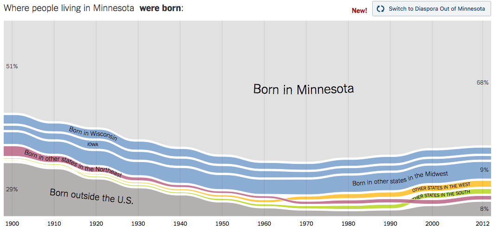
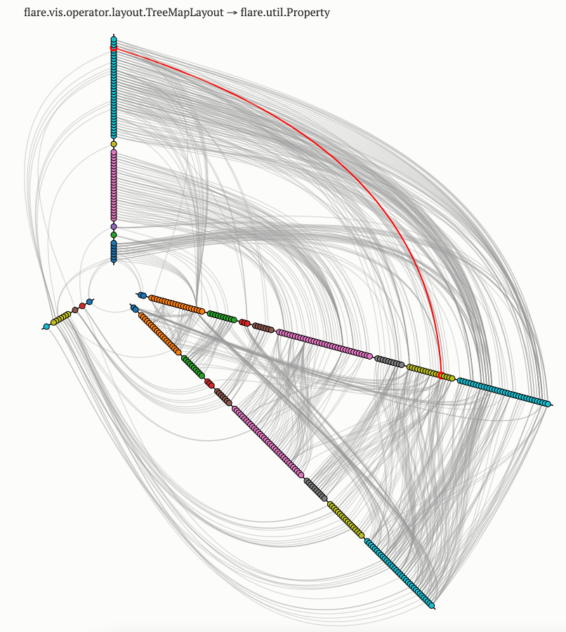
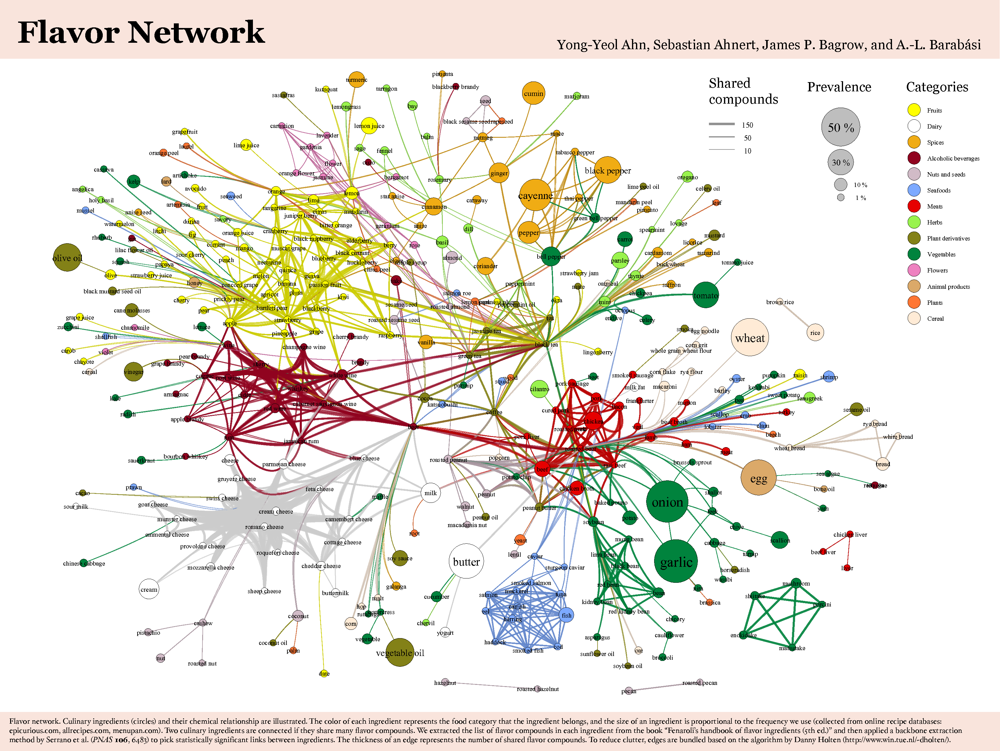
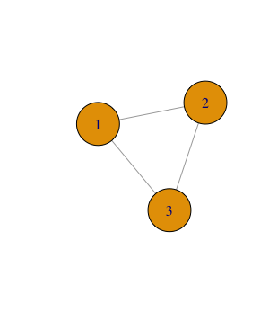
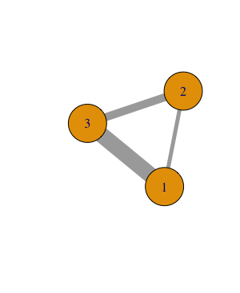
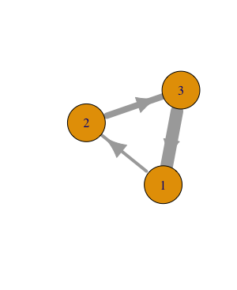

# Sociograms and Density {#ch5}

**In this week, we will:**

- Understand how network visualizations work
- Become familiar with a number of network-level measures
- Compute network-level measures using sample data

<!-- <iframe width="560" height="315" src="https://www.youtube.com/embed/CDvtwwWIcS4" frameborder="0" allowfullscreen></iframe> -->

<!-- **An overview of Week 5 activities:** -->

<!-- - *Read* and *build knowledge* -->
<!--     - Carolan, ch. 5 -->
<!--     - Annotate measures with mathematical/computational solutions -->
<!--     - Identify network-level measures not covered by the book and share to the class -->
<!-- - *Complete the data collection hands-on assignment* -->
<!-- - *Compute network-level measures and share to the class* -->

## Sociograms and network visualizations

In [Lab 1](#lab1), we created our first `sociogram` or network visualization based on an example dataset. 

A `sociogram` is a graphic representation of a social network.[^1] Its goal is to transform mathematical representations of a network -- e.g., an adjacency matrix -- into a network drawing.

[^1]: See https://en.wikipedia.org/wiki/Sociogram

The first sociogram is attributed to psychiatrist **Jacob L Moreno**,[^2] for his hand-drawn image (see below) "depicting friendship patterns between the boys and the girls in a class of schoolchildren, presented at a medical conference in New York in 1933".[^3]

[^2]: See https://www.historyofinformation.com/detail.php?id=3334
[^3]: See https://slate.com/technology/2014/10/j-l-moreno-a-psychologists-30s-experiments-invented-social-networking.html

Nowadays we rely on `network layout` algorithms to help us determine the placement of nodes and edges in the drawing. Network layouts are simply algorithms that return coordinates for each node in a network. Before the invention of such algorithms, researchers had to use graph drawing heuristics to produce network graphs by hand, which could involve multiple iterations of drawing. Nowadays we ask the computer to do the job for us :).

**Decision Point**. How you make a sociogram depends on what information, such as network structures and patterns, you hope to visually convey. Even though sociograms we've seen in readings are predominantly `force directed`,[^4] it does not mean force-directed layouts are always the best choices.

[^4]: See https://en.wikipedia.org/wiki/Force-directed_graph_drawing

The following knowledge and understanding are important for making a sociogram:[^5]

- Know common network visualization goals (e.g., revealing segregation, showing hierarchy)
- Know network visualization types (e.g., heat maps, network maps, hive plots), and corresponding layout algorithms
- Know visualization controls (e.g., size, color, shape, width, position)

[^5]: See http://kateto.net/network-visualization

Putting knowledge into action, when producing a sociogram you need to:

1. Identify a network visualization goal (or goals)
2. Choose a network visualization type
3. Apply proper visualization controls
4. *If needed*, repeat 1-3.

Below, I present a few network visualization examples that do not draw on force-directed layouts.

### Example 1: Global Flight Network

(Source: [visualisingdata.com](http://www.visualisingdata.com/blog/wp-content/uploads/2012/02/World_FlightLines_BioDiaspora-600x393.jpg))

1. Goal: Visualize patterns of the global flight network, for example, to see intensive flight activities in certain areas
2. Type: The coordinates are determined by the origin and destination of each flight. In other words, no additional algorithmic decisions are made beyond the use of a (projected) world map. 
3. Controls: Line color represents duration of a flight. Brightness of each line adds up to each other to represent the intensity of flight activities in certain areas.

Note: How will this visualization look differently if the map is not eurocentric? Does it matter? What 'world-views' might have been built into such a visualization?

### Example 2: Networks of interaction in mobile animal groups 

<iframe width="560" height="315" src="https://www.youtube.com/embed/hpVENCrwJ1s" frameborder="0" allowfullscreen></iframe>  
(See [the article](http://www.pnas.org/content/112/15/4690/F3.expansion.html))

Here the concern is network dynamics, and the placement of each node (representing each individual animal) is based on its (projected) physical location in the real world. 

Note: In this movie, which information naturally existed and which information was constructed by researchers?

### Example 3: Migration Network

  
(Source: [NYT: Where We Came From and Where We Went, State by State](https://www.nytimes.com/interactive/2014/08/13/upshot/where-people-in-each-state-were-born.html#Minnesota))

This visualization attempts to visualize migration `flows` into Minnesota across time. This visualization could be seen as a series of ego-centric networks of Minnesota in terms of migration into the state.

Note: Like Example 2, which information naturally existed and which information was constructed by researchers? Which decisions did the 'data journalist' make in this graph?

### Example 4: Light Up the Curriculum

  
(See [interactive version here](https://bost.ocks.org/mike/hive/))

This visualization show the dependency graph of a software library. This visualization technique is called `hive plots.` Each dot represents a class/type (in programming language), and each line represents an import statement (or a mention) from one class to another. Related classes share the same color.

### Example 5: The Food Network Backbone

If you are a foodie, you may appreciate this visualization of flavors backed up by [some hardcore science](https://www.researchgate.net/publication/51959358_Flavor_network_and_the_principles_of_food_pairing). Do you find the use of graphical devices by the authors illuminating in this example?

### Play more with network visualizations

This part is **optional**. I'm providing more materials for those who hope to explore network visualization a bit more. Also, note that there are some "advanced" concepts in these materials that we will discuss in later weeks.

#### Building on Lab 2

I encourage you to take a look at [this tutorial](http://kateto.net/network-visualization). Section 1 provides a really informative overview of network visualization. Detailed plotting strategies start from Section 4. 

You can download data and R scripts used in this tutorial from [the author's Github repository](https://github.com/kateto/R-Network-Visualization-Workshop). Or you can grab R code from this tutorial and add new plotting scripts in your Lab 2. 

Sky is the limit. Please share what you come up with on Slack. 

#### Exploring Gephi - a powerful network visualization tool

If you want to take a break from R scripts, you can check out the following video that demonstrates Scientific Literature Analysis using [Gephi](https://gephi.org/). Note: Gephi requires Java, which is usually already installed on a modern computer. 

<iframe width="560" height="315" src="https://www.youtube.com/embed/QRx-yBcPTV8" frameborder="0" allowfullscreen></iframe>

You are also encouraged to check out the first 3 sections of [this Gephi tutorial](http://www.martingrandjean.ch/gephi-introduction/).

As always, please report back to our Slack `general` channel.

## Density and Other Structural Measures for Complete Networks

The book chapter you read this week already does a great job introducing a list of commonly used network-level measures.

Below, I make several extra points that are not covered:

First, the book chapter is based on a `directed, non-weighted` network. We need to recognize that there are several types of networks based on the kinds of ties they have (see Table 5.1[^4]). Take the measure of `density` for example, the number of possible links are different for a directed network and an undirected network with the same `size`: a directed network has more possible links because each pair of nodes have two possible links. There are different algorithms (built in SNA tools) that would account for network types when calculating these measures. 

|            | Undirected | Directed |
|------------|:-----------|:---------|
| **Unweighted** |  |  |
| **Weighted**   |  |  |

: Table 5.1: Different types of networks.

[^4]: See [the R code I wrote](https://github.com/meefen/sna-ed/blob/master/assets/05-demo.R) to produce these toy networks.

Second, the researcher sometimes need to make important decisions when computing network measures, even if a same algorithm is applied. For example, for a weighted network, it is a common practice to set a `threshold` of weight (based on some justified reasons) to filter links weaker than the threshold (see Example 4 from the previous page). Then network `density` could be computed the same way as an unweighted network. In this case, the calculated measure of density is highly sensible to the researcher's decisions, which are influenced by her/his assumptions of the network. (**Decision Point**)

> "It is important that a researcher does not use a measure simply because it is available in a standard program. A researcher must always be perfectly clear about the assumptions involved in any particular procedure, and must report these along with the density measures calculated" (Scott, 2013, p. 73)

As we're diving into specific SNA techniques -- such as `density`, `average degree` -- I want to remind you of the "3 levels of considerations" we explored in [Week 2](https://bookdown.org/chen/snaEd/understanding-sna-in-educational-research.html). Decision points we've covered this week, such as which layout to use and what threshold to apply when computing density of a weighted network, are often informed by theoretical frameworks we adopt in a study or contextualized knowledge we have about a research problem. It is important for us to make our theoretical assumptions explicit in an SNA study. 

## Week 5 Activities

Here I'd like to remind you again of the weekly participation timeline:

### Read and Annotate

**Read** [Carolan (2014) Chapter 5](http://methods.sagepub.com.ezp1.lib.umn.edu/book/social-network-analysis-and-education/n5.xml). **Annotate** as we normally do using proper hashtags (e.g., `question`, `idea`).

**Build community knowledge**: When reading through the chapter, **identify** at least one network-level measure, **conduct research** on how it could be computed using R (or another tool of your choice), and **share** your solution via a Hypothesis annotation. Include in your Hypothesis annotation this tag `compute` so that we can bring our knowledge together.

- If you found someone else has already covered your 'favorite' measure, try to **build on** the existing solution by, for example, introducing a parameter/mechanism to deal with weighted networks. 

Finally, if you find a network-level measures not captured in the book, please post a Slack message to briefly introduce the measure and provide a computation method.

### Assignment: Data collection hands-on

In the past few weeks, you were introduced to a few ways to capture network data, e.g., adjacency matrix, edge list. This week, you are encouraged to identify a dataset -- public or your own -- and organize it according to the "tidy data" principles discussed in Week 4. 

- The [Network Data Repository](https://networkdata.ics.uci.edu/index.html) is a good place to look at, or you can build a network based on public data (e.g., from a novel, Twitter). Take a look at [NodeXL](http://nodexlgraphgallery.org/Pages/Default.aspx) if you're interested in public Twitter data.
- You're not expected to accomplish an SNA study by the end of this semester, but you are encouraged to work on an authentic study of your own if possible.
- If the public dataset you find is not tidy, you will need to transform it to a tidy dataset. 

When submitting this assignment, depending on whether your dataset contains sensitive data or not, you can choose to share it with the class on the `general` Slack channel, or only share computed results (more below) with the class on Slack.

### Continue to work on Lab 2 - Network-level measures

Please continue to work on Lab 2, and try to compute network-level measures of either the sample dataset provided in Lab 2 or another dataset you find or create. 

Given we are building community knowledge together, you are encouraged to incorporate ideas, scripts, strategies shared by other colleagues in your own analysis. I only demonstrated the calculation of `density` in Lab 2. There are many other network measures you can easily compute using `igraph`. 

Finally, please share your findings and questions in the `2021-labs` channel. You are encouraged to share scripts or mini-videos even though they are not required. You are also encouraged to 'triangulate' measures with visualizations. 

Enjoy a great week!
