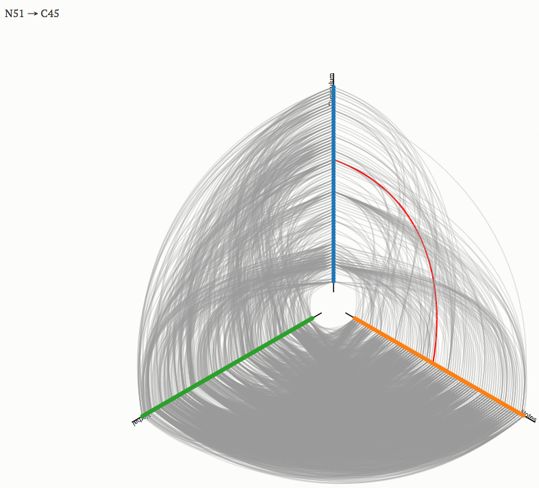

# Sociograms and Density {#ch5}

**In this week, we will:**

- Understand how network visualization works
- Become familiar with a number of network-level measures
- Compute network-level measures using concrete data

<iframe width="560" height="315" src="https://www.youtube.com/embed/CDvtwwWIcS4" frameborder="0" allowfullscreen></iframe>

**An overview of Week 5 activities:**

- *Read* and *build knowledge*
    - Carolan, ch. 5
    - Annotate measures with computational solutions
    - Identify network-level measures not covered by the book and share to the class
- *Complete the data collection hands-on assignment*
- *Compute network-level measures and share to the class*

Finally, no matter whether you're a formal or open participant of this class, **please consider participating in a related research project**. Information about this project and an electronic consent form can be found on [this page](https://goo.gl/forms/M7305n1mMEF1aPWk1). Your voluntary participation would be much appreciated.

## Sociograms and network visualizations

A `sociogram` is a graphic representation of a social network.[^1] Its goal is to transform mathematical representations of a network -- e.g., a distance matrix -- into a network drawing.

[^1]: See https://en.wikipedia.org/wiki/Sociogram

The creation a sociogram depends on `network layout` algorithms. Network layouts are simply algorithms that return coordinates for each node in a network. Before the invention of such algorithms, researchers had to use graph drawing heuristics to produce network graphs by hand, which could involve multiple iterations of drawing. Nowadays we ask the computer to do the job for us :).

**Decision Point**. How you make a sociogram depends on what information, such as network structures and patterns, you hope to visually convey. Even though sociograms we've seen in readings are predominantly `force directed`,[^2] it does not mean force-directed layouts are always the best choices.

[^2]: See https://en.wikipedia.org/wiki/Force-directed_graph_drawing

The following knowledge and understanding are important for making a sociogram:[^3]

- Know common network visualization goals (e.g., revealing segregation, showing hierarchy)
- Know network visualization types (e.g., heat maps, network maps, hive plots), and corresponding layout algorithms
- Know visualization controls (e.g., size, color, shape, width, position)

[^3]: See http://kateto.net/network-visualization

Putting knowledge into action, when producing a sociogram you need to:

1. Identify a network visualization goal (or goals)
2. Choose a network visualization type
3. Apply proper visualization controls
4. *If needed*, repeat 1-3.

Below, I present a few network visualization examples that do not draw on force-directed layouts.

### Example 1: Global Flight Network

(Source: [dadaviz](http://dadaviz.com/i/2641/))

1. Goal: Visualize patterns of the global flight network, for example, to see intensive flight activities in certain areas
2. Type: The coordinates are determined by the origin and destination of each flight. In other words, no additional algorithmic decisions are made beyond the use of a world map.
3. Controls: Line color represents duration of a flight. Brightness of each line adds up to each other to represent the intensity of flight activities in certain areas.

Note: How will this visualization look differently if the map is not eurocentric? Does it matter? What 'world-views' might have been built into such a visualization?

### Example 2: Networks of interaction in mobile animal groups 

<iframe width="560" height="315" src="https://www.youtube.com/embed/hpVENCrwJ1s" frameborder="0" allowfullscreen></iframe>  
(See [the article](http://www.pnas.org/content/112/15/4690/F3.expansion.html))

Here the concern is network dynamics, and the placement of each node (representing each individual animal) is based on its (projected) physical location in the real world. 

Note: In this movie, which information naturally existed and which information was constructed by researchers?

### Example 3: Migration Network

  
(Source: [NYT: Where We Came From and Where We Went, State by State](https://www.nytimes.com/interactive/2014/08/13/upshot/where-people-in-each-state-were-born.html#Minnesota))

This visualization attempts to visualize migration `flows` into Minnesota across time. This visualization could be seen as a series of ego-centric networks of Minnesota in terms of migration into the state.

Note: Like Example 2, which information naturally existed and which information was constructed by researchers? Which decisions did the 'data journalist' make in this graph?

### Example 4: Light Up the Curriculum

  
(See [interactive version here](http://bodong.ch/assets/hive/lightup.html))

This is a visualization made to demonstrate semantic similarity among three types of documents---curriculum standards, students' online posts, and their verbal discussions. This visualization technique is called `hive plots.` Each axis represents a type of document. This visualization was chosen because researchers only cared about cross-type linkages and didn't care about the links within each document type.

### Play more with network visualizations

This part is **optional**. I'm providing more materials for those who hope to explore network visualization a bit more. Also, note that there are some "advanced" concepts in these materials that we will discuss in later weeks.

**Track R**: I encourage you to follow [this tutorial](http://kateto.net/network-visualization) I've already mentioned above. You can download data and R scripts used in this tutorial from [the author's Github repository](https://github.com/kateto/R-Network-Visualization-Workshop). 

**Track Gephi**: I encourage you to read the first section of [this tutorial](http://kateto.net/network-visualization). Also, check out the following video that demonstrates Scientific Literature Analysis using Gephi. You are also encouraged to check out the first 3 sections of [this Gephi tutorial](http://www.martingrandjean.ch/gephi-introduction/).

<iframe width="560" height="315" src="https://www.youtube.com/embed/QRx-yBcPTV8" frameborder="0" allowfullscreen></iframe>

As always, please report back to our track-specific Slack channels -- `Gephi` and `R`.

## Density and Other Structural Measures for Complete Networks

[Carolan (2014), chapter 5](http://methods.sagepub.com.ezp1.lib.umn.edu/book/social-network-analysis-and-education/n5.xml) does a great job introducing a list of commonly used network-level measures.

Below, I make several extra points that are not covered:

First, the chapter is based on a `directed, non-weighted` network. We need to recognize that there are several types of networks based on the kinds of ties they have (see Table 5.1[^4]). Take the measure of `density` for example, the number of possible links are different for a directed network and an undirected network with the same `size`: a directed network has more possible links because each pair of nodes have two possible links. There are different algorithms (built in SNA tools) that would account for network types when calculating these measures. 

|            | Undirected | Directed |
|------------|:-----------|:---------|
| **Unweighted** |  |  |
| **Weighted**   |  |  |

: Table 5.1: Different types of networks.

[^4]: See [the R code I wrote](https://github.com/meefen/sna-ed/blob/master/assets/05-demo.R) to produce these toy networks.

Second, the researcher sometimes need to make important decisions when computing network measures, even if a same algorithm is applied. For example, for a weighted network, it is a common practice to set a `threshold` of weight (based on some justified reasons) to filter links weaker than the threshold (see Example 4 from the previous page). Then network `density` could be computed the same way as an unweighted network. In this case, the calculated measure of density is highly sensible to the researcher's decisions, which are influenced by her/his assumptions of the network. (**Decision Point**)

> "It is important that a researcher does not use a measure simply because it is available in a standard program. A researcher must always be perfectly clear about the assumptions involved in any particular procedure, and must report these along with the density measures calculated" (Scott, 2013, p. 73)

As we're diving into specific SNA techniques -- such as `density`, `average degree` -- I want to remind you of the "3 levels of considerations" we explored in [Week 2](https://bookdown.org/chen/snaEd/understanding-sna-in-educational-research.html). Decision points we've covered this week, such as which layout to use and what threshold to apply when computing density of a weighted network, are often informed by theoretical frameworks we adopt in a study or contextualized knowledge we have about a research problem. It is important for us to make our theoretical assumptions explicit in an SNA study. 

## Assignments and Activities

**Due by Monday, 2/20, 11:59PM**

### Read and build knowledge

**Read** [Carolan (2014) Chapter 5](http://methods.sagepub.com.ezp1.lib.umn.edu/book/social-network-analysis-and-education/n5.xml). Make Hypothesis annotations as we normally do using proper hashtags (e.g., `question`, `idea`). Don't forget to include our `SNAEd` course hashtag.

**Build knowledge as a group**: When reading through the chapter, **identify** at least one network-level measure, **conduct research** on how it could be computed using R or Gephi, and **share** your solution using Hypothesis. Include at least three hashtags in your Hypothesis annotation: `SNAEd`, `compute` and `R`/`Gephi`.
- If you found someone else has already covered your 'favorite' measure, try to **build on** the existing solution by, for example, introducing a parameter/mechanism to deal with weighted networks. 

Finally, if you find a network-level measures not captured in the book, please annotate **HERE** on this page. Briefly introduce the measure and provide a computation technique. 

### Assignment: Data collection hands-on

As the second project checkpoint, you are required to turn in a dataset that is organized according to the "tidy data" principles discussed last week. 

- If your proposed project idea that involves human subjects and requires an IRB approval, for this assignment you can draft **a data collection plan for your project** AND **find a publicly available dataset to work with**. If the public dataset you find is not tidy, you will need to transform it to a tidy dataset. The [Network Data Repository](https://networkdata.ics.uci.edu/index.html) is a good place to look at, or you can build a network based on public data (e.g., from a novel, Twitter).
    - If you plan to conduct your proposed project that requires an IRB approval, please get in touch with Bodong to work on an IRB application.  This [IRB webpage](http://www.research.umn.edu/irb/research.html) is a great starting point for you to decide whether you need an IRB approval.

When submitting this assignment, depending on whether your dataset contains sensitive data or not, you can choose to share it publicly within the class on the `assignment` Slack channel, or via PM to Bodong, or only share computed results (more below) with the class on Slack.

### Compute network-level measures and share

No matter which dataset you use, please try to compute network-level measures and share back to the class on Slack. You are encouraged to share scripts (for Track R) or mini-videos (for Track Gephi and R) even though they are not required. You are also encouraged to 'triangulate' measures with visualizations. 

Enjoy a great week!
