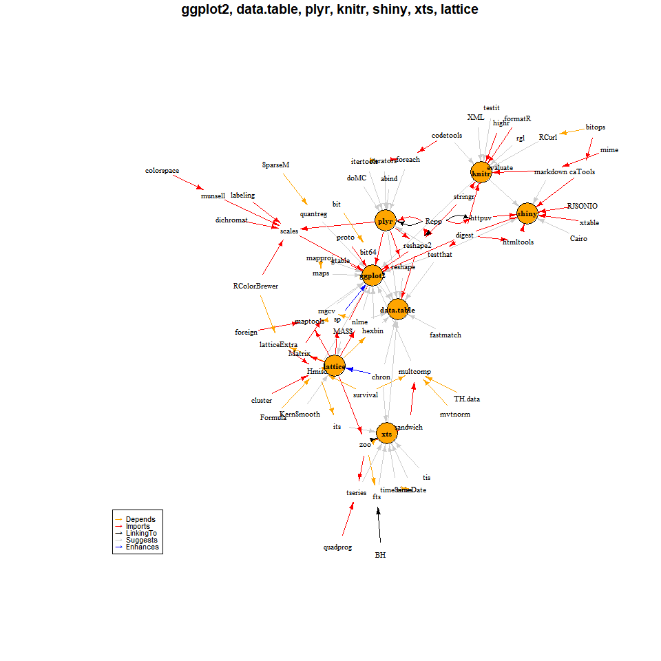
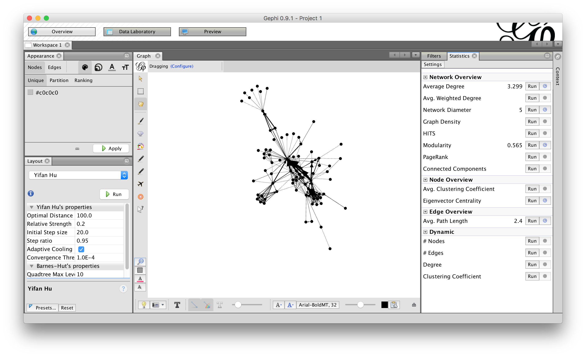
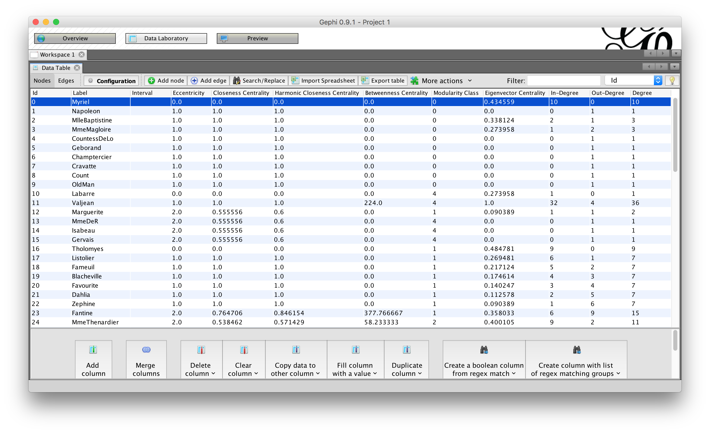

# Centrality and Centralization {#ch6}

In Week 5, we explored a range of network-level measures, including `size`, `density`, `diameter`, `average path length`, `centralization`, `reciprocity`, `transitivity`, `clustering coefficient`, and so on. There are other interesting measures not covered by the textbook but worth your attention:[^1]

- `Cohesion`: The degree to which actors are connected directly to each other by cohesive bonds.
- `Structural cohesion`: The minimum number of members who, if removed from a group, would disconnect the group.

[^1]: See https://www.politaktiv.org/documents/10157/29141/SocNet_TheoryApp.pdf.

You have done a phenomenonal job digging into different concepts and measures and sharing your findings back to the group via annotations. A shout-out to **HopeinJ** for asking an important question:

> \@bech0079, I don't quite understand the difference btw the network.density between the network.density and edge.density, both gives the ratio between extant edges/potential edges.https://www.rdocumentation.org/packages/network/versions/1.13.0/topics/network.density Do you have any idea on that?

I want to take this opportunity to mention that there is a "universe" of R packages, the dependencies among which can be visualized as a giant graph (see [this page](http://datastorm-open.github.io/DependenciesGraphs/)). Among these packages, there are many packages developed for SNA. The `network` package mentioned by **HopeinJ** is another R package that can be used for SNA. In `igraph`, please use `[edge_density](https://www.rdocumentation.org/packages/igraph/versions/1.2.4/topics/edge_density)` to compute network density.



Please make sure to check [our Hypothes.is annotations](https://hypothes.is/groups/REimiBzy/snaed-2019) to learn about contributions from other colleagues. If there are burning questions, please continue the discussion on Slack. 

**This week, we will**:

- Engage with node-level measures in social networks
- Understand how network-level and node-level measures are connected
- Learn to calculate node-level measures using SNA applications


## Centrality and Centralization: An Overview

When we consider the importance of a `node` in a social network, how *central* it is usually an important consideration. In Week 4, we were able to use sociograms to identify central nodes in a network. How can we identify those central nodes mathematically in case they are not easily visually identifiable?

`Centrality` is a key measure in SNA developed to achieve this goal. SNA researchers have developed many ways to quantify centrality in a network. Below, I curate a list of quality resources for you to explore different centrality measures. I selected these resources because of varied ways they present centralities -- equations vs. intuitions, real-world examples vs. toy networks, step-by-step demonstrations vs. one-step computation.

First, review [the following PDF presentation](http://www.stat.washington.edu/~pdhoff/courses/567/Notes/l6_centrality.pdf) presenting four main centrality measures: `Degree Centrality`, `Betweenness Centrality`, `Closeness Centrality`, and `Eigenvector Centrality`. Note that the author introduces node-level `centrality` and network-level `centralization` together in this presentation. These two concepts are often mistakenly treated as the same by researchers. Now you see their differences and connections. Also, if you could follow the math equations, that would be great; if not, please focus on the intuitions.

<embed src="http://www.stat.washington.edu/~pdhoff/courses/567/Notes/l6_centrality.pdf" width="100%" height="400px" />

Second, watch the following video from Lada Adamic covering `Degree Centrality`, `Betweenness Centrality`, and `Closeness Centrality` with concrete examples. She also made an attempt to distinguish centralities from centralization. She also noted that when considering centrality, it is very important to be clear about the scope, or the boundary like we discussed in Week \@ref(ch4). A little tweak will make a difference.

<iframe width="560" height="315" src="https://www.youtube.com/embed/RXohUeNCJiU?list=PL2rR6Wa-StjYOW7v6J8_npck6EDOKEbCN" frameborder="0" allowfullscreen></iframe>


## Betweenness Centrality

Diving deeper, `betweenness centrality` is probably the most popular centrality measure I've personally seen in educational research. The notion of residing *in-between* has strong implications for many scenarios, either for facilitating/blocking access to resources or encouraging creativity. So I think `betweenness centrality` is worth further exploration.

Below is a great video made by James Cook to explain `betweenness centrality`. Enjoy!

<iframe width="560" height="315" src="https://www.youtube.com/embed/Tfbu-nGATmY?list=PLUNsmFTO5nwm4VJQBaO74MF1A8KZfAOi9" frameborder="0" allowfullscreen></iframe>

## Eigenvector Centrality

`Eigenvector centrality` is another centrality measure that is well aligned with the social capital theory. Watch the following video by Lada to find out more.

<iframe width="560" height="315" src="https://www.youtube.com/embed/0Z2KubLKnHg?list=PL2rR6Wa-StjYOW7v6J8_npck6EDOKEbCN" frameborder="0" allowfullscreen></iframe>


## Week 6 Activities

### Readings

None. The textbook does not provide a specific introduction to centraly measures for a whole network. 

But you're encouraged to look back into **example papers** you selected in Week 3 to see whether you've developed any fresh understanding after diving deeper into these measures. Please share your findings with the class on Slack.

### Compute Node-level Measures

Like last week, you can continue to use a dataset you have, either your own dataset or a public one.

#### Track R

Search "centrality" on [the igraph doc page](http://igraph.org/r/doc/). For example, you will find that `betweenness(g)` is the function for computing *betweenness centrality*. Apply these centrality functions on your dataset from Week 5. Tweak the parameters, such as `directed`, to see how the results might change. Share your findings on Slack.


#### Track Gephi

Some of you have already played with Gephi's **Statistics panel** in Week 4. For this week,

- Check page 12 of [this Gephi tutorial](https://gephi.org/tutorials/gephi-tutorial-quick_start.pdf) to see how centralities could be computed using Gephi. See Figure \@ref(fig:gephi-overview).
- Toggle to **Data Laboratory** to see results of Gephi computations in the **Data Table** tab. For example, if you click on **Network Diameter** in the Statistics panel, a number of centrality measures (including betweenness centrality) will be saved in the Data Table. You can click on the header of each column to sort the Data Table. See  Figure \@ref(fig:gephi-data-lab).
- Share your findings on Slack.

```{r gephi-overview, out.width='90%', echo=FALSE, fig.show='hold', fig.cap='Gephi Graph Overview.'}

```

```{r gephi-data-lab, out.width='90%', echo=FALSE, fig.show='hold', fig.cap='Gephi Data Laboratory.'}

```


Like earlier weeks, if you have any questions or ideas, share in corresponding channels on Slack. Enjoy a great week!
