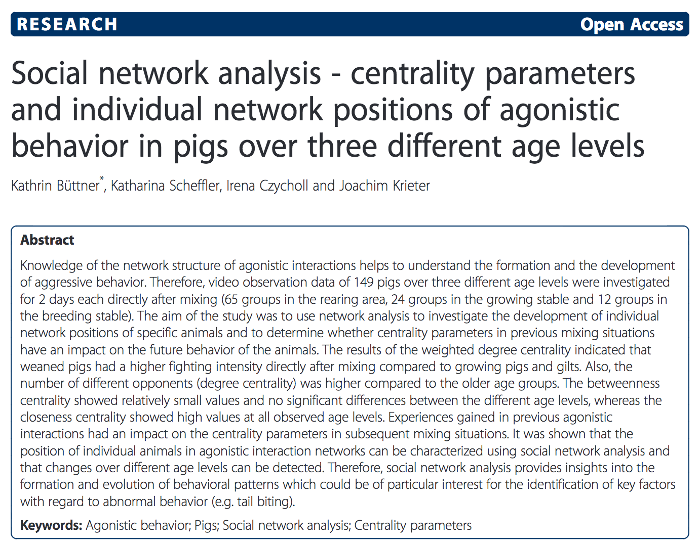

# What Is SNA -- Again?   How it could be used in education?

Bodong Chen

---

# What do people mean by SNA?

---

---

- Density
- Centrality
- Structural equivalence
- Distance
- Clique
- Reachability
- ...

---

---

## 

*Connectivism* learning theory (Siemens)

---

# Three Levels

## P
philosophy, worldviews, paradigms
 

## M
methodology
 

## m
methods/techniques
 

---

## Qual vs. Quan
or
## Mixed

---

## Research Questions