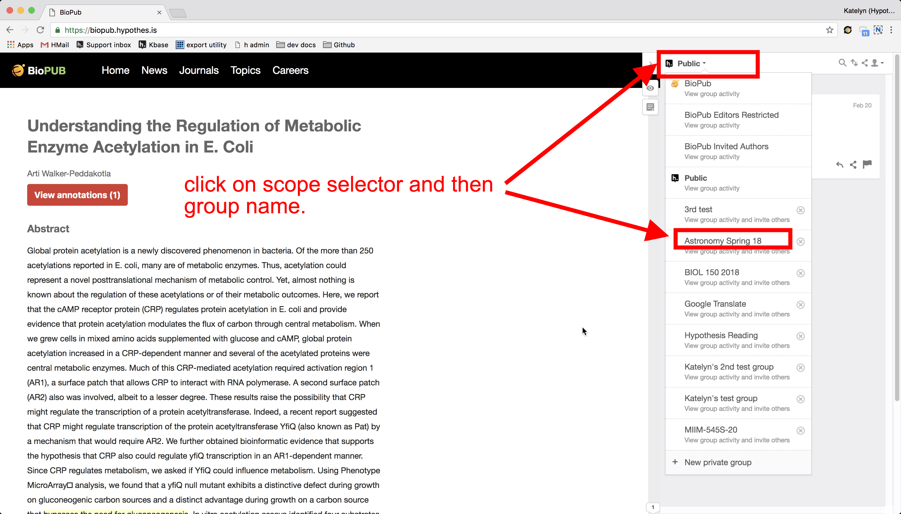
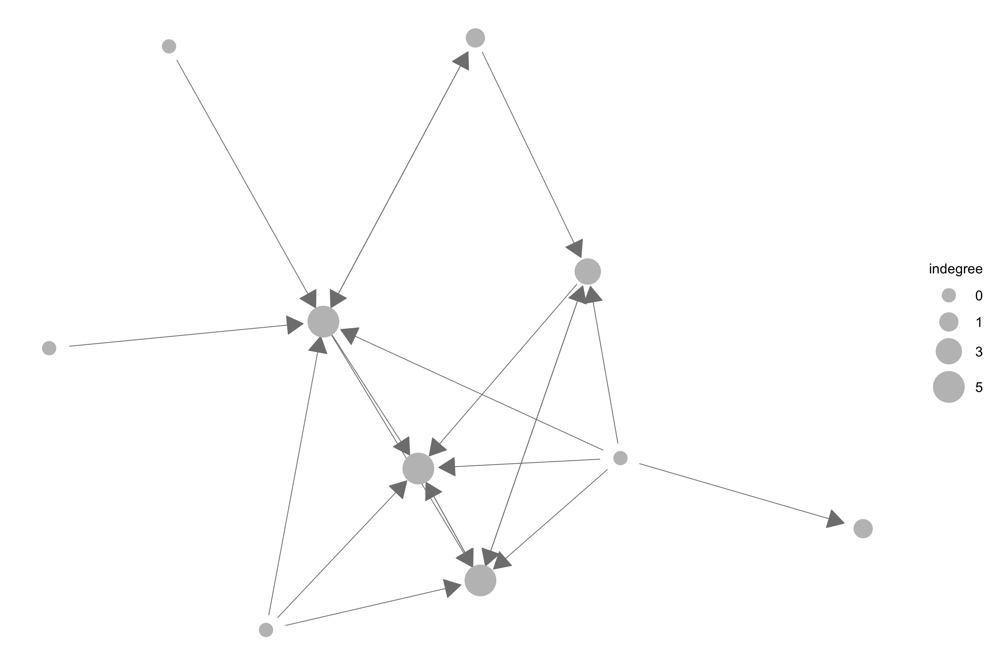
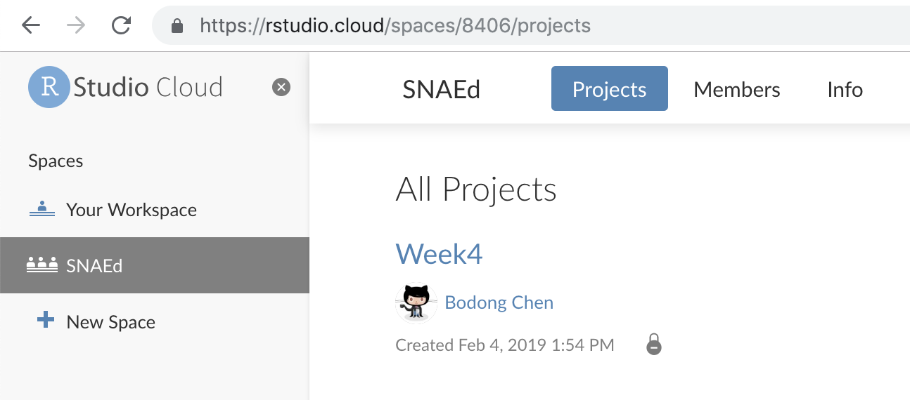

--- 
title: "Applied Social Network Analysis in Education"
# author: "Bodong Chen"
# date: "`r Sys.Date()`"
knit: "bookdown::render_book"
documentclass: krantz
bibliography: [biblio.bib, packages.bib]
biblio-style: apalike
link-citations: yes
colorlinks: yes
lot: yes
lof: yes
fontsize: 12pt
monofont: "Source Code Pro"
monofontoptions: "Scale=0.7"
site: bookdown::bookdown_site
description: "This is a course handbook written by Bodong Chen for his SNA course at UMN."
url: 'https\://bookdown.org/chen/snaEd/'
github-repo: meefen/sna-ed
cover-image: images/cover.png
---

```{r setup, include=FALSE}
options(
  htmltools.dir.version = FALSE, formatR.indent = 2,
  width = 55, digits = 4, warnPartialMatchAttr = FALSE, warnPartialMatchDollar = FALSE
)

lapply(c('DT', 'citr', 'formatR'), function(pkg) {
  if (system.file(package = pkg) == '') install.packages(pkg, repos = c(CRAN = "http://cran.rstudio.com"))
})
```

# Preface {-}

This site is the course portal of **CI 8371 - Applied Social Network Analysis in Education**, taught by **[Prof. Bodong Chen](http://bodong.ch)** at the University of Minnesota in Spring '19. 

Content on this site is actively built and refined throughout the semester. 

### Key links for the course {-}

- **[Textbook Carolan (2014)](http://methods.sagepub.com.ezp1.lib.umn.edu/book/social-network-analysis-and-education)**. *Note*: UMN library access required.
- [**Slack team**](https://snaed.slack.com/): We use Slack for course "management", aka. announcements, commucations, chats, small group work, etc. You can also get connected with course alumli via public Slack channels.
- [**Hypothes.is**](https://hypothes.is/): We interact on top of web materials (including the textbook) during this course. Hypothesis is a cutting-edge, open-source *web annotation* tool, which is used more and more broadly [by educators](https://hypothes.is/education/) in the past two years.
- Optional -- [**Twitter** hashtag #SNAEd](https://twitter.com/search?q=%23snaed): You can tweet about this course using #SNAEd.


  
This site or book is licensed under the [Creative Commons Attribution-NonCommercial-ShareAlike 4.0 International License](http://creativecommons.org/licenses/by-nc-sa/4.0/).

Last update: `r Sys.Date()`

```{r fig.align='center', echo=FALSE, include=identical(knitr:::pandoc_to(), 'html'), fig.link='#'}
knitr::include_graphics('images/cover.png', dpi = NA)
```

## Why not Canvas for this course? {-}

To learn social network analysis (SNA) -- and many other stuff -- I believe the best way is to 'live' with it. That is, the best way to learn SNA is to seize every opportunity of applying SNA in one's own learning journey. This philosophy leads to two major reasons I'm piecing together a learning environment by myself:[^1]

- First, as an instructor I wish to foster **social interactions** as much as possible. Traditional learning management systems, like Moodle and Canvas, do not prioritize this goal
- Second, to **practice SNA with our own 'learning traces'**, system log data[^2] need to be somehow exposed to users. Traditional systems are less transparent in this area.


If you haven't used these tools mentioned above, no worries. I will provide detailed guidelines to get you started (see Section \@ref(digital)). **Many of us would be venturing out of our comfort zones.** (SO DO I -- because I cannot stop trying new things :-).) I hope we will all learn a great deal about SNA and beyond.

Have fun!

[^1]: I've published these ideas as [a *design case* on TechTrends](https://link.springer.com/article/10.1007/s11528-018-0284-7) if you're interested in reading more.

[^2]: I treat 'data' as [plural](https://en.oxforddictionaries.com/definition/us/data) in the course.

## Two tracks of participation {-}

This course website is openly available online, reflecting my committment to '[open scholarship](http://meefen.github.io/notes/)'. So there are two tracks of participation designed for this class.

1. **UMN class**: For UMN graduate students enrolled in the class, your participation in this class is not that different from taking another online class. You are expected to meet course requirements outlined in the course syllabus. You will have *private spaces* (on Slack and Hypothes.is) for within-class communication.
2. **Open participation**: For 'Open Participants' who are following the class, you can access the same materials I curate on this website. You may need to buy the required textbook if you do not have a library access. And ways for you to participate include 1) making public Hypothes.is annotations using tag `SNAEd`, and 2) tweeting out your ideas or links to your blog posts using hashtag `#SNAEd`. Open Participants accomplishing major course requirements will be offered [Digital Badges](https://openbadges.org/).

If you have any feedback on the current design, please get in touch. I'd love to hear your thoughts.

## Ways to contribute to this site {-}

This is the 2nd time I am offering this course and the 3rd time teaching in such an 'open' manner. By making this course site open, I hope it could be useful beyond the formal class. So I'd appreciate your help to continually improve the site.

1. The best way to contribute to this site is to annotate it using [Hypothes.is](https://hypothes.is/). For example, to point out a possible spelling error, you can highlight the error and include two tags -- `SNAEd` and `issues` -- in your annotation.
2. The second best way is to report a `New Issue` on this website's [Github issues page](https://github.com/meefen/sna-ed/issues).
3. If you're Github-savvy, please consider forking the [Github repository](https://github.com/meefen/sna-ed/), making edits, and sending me a pull request.
4. If none of those options work for you, simply drop me an email at chenbd\@umn.edu.

<!--chapter:end:index.Rmd-->

# Syllabus {-}

The most up-to-date syllabus is <a href="http://bit.ly/sna-syl-19" target="_blank">here</a>.
Please post Hypothes.is annotations on the syllabus if you have any questions.

<!--chapter:end:00-syllabus.Rmd-->

# Introduction {#intro}

This week we will: 

1. Get to know each other
2. Walk through the Syllabus
3. Get to know course logistics

<iframe width="640" height="360" src="https://www.youtube.com/embed/JvgqCZtLtp0?rel=0" frameborder="0" allowfullscreen></iframe>

<!-- Please click on the '>' button to proceed to the next page. -->

<!-- <iframe src="https://h5p.org/h5p/embed/1405" width="1090" height="377" frameborder="0" allowfullscreen="allowfullscreen"></iframe><script src="https://h5p.org/sites/all/modules/h5p/library/js/h5p-resizer.js" charset="UTF-8"></script> -->

<!-- <iframe src="https://h5p.org/h5p/embed/53171" width="1117" height="2675" frameborder="0" allowfullscreen="allowfullscreen"></iframe><script src="https://h5p.org/sites/all/modules/h5p/library/js/h5p-resizer.js" charset="UTF-8"></script> -->

## What is Social Network Analysis?

### A light intro video made by colleagues from Duke.

<iframe width="640" height="360" src="https://www.youtube.com/embed/xT3EpF2EsbQ?list=PL1M5TsfDV6Vs7tnHGNgowEUwJW-O8QVp5" frameborder="0" allowfullscreen></iframe>

[Credit: ModU: Powerful Concepts in Social Science](https://www.youtube.com/channel/UCDfHkEuoKb_TXYkQY6BkIIg)


### A deeper dive: The hidden influence of social networks

<iframe width="560" height="315" src="https://www.youtube.com/embed/2U-tOghblfE" frameborder="0" allowfullscreen></iframe>

## Why Social Network Analysis?

### Perspectives from colleagues

We come together to learn (more) about social network analysis (SNA) -- for various reasons. In preparation for the class, I invited three colleagues who're all doing interesting work with SNA to share a bit about their experiences (note some videos are only visible for UMN viewers):

**Alejandro Andrade**, PhD from Indiana University, now Data Scientist at ACT

<iframe width="640" height="360" src="https://www.youtube.com/embed/jQVWJonzASM?rel=0" frameborder="0" allowfullscreen></iframe>

**Michael Brown**, PhD from the University of Michigan, now Assistant Professor at Iowa State

<iframe width="640" height="360" src="https://www.youtube.com/embed/znlFO7nAli4?rel=0" frameborder="0" allowfullscreen></iframe>

**Fan Ouyang**, PhD from the University of Minnesota, now Assistant Professor at Zhejiang University

<iframe src="https://drive.google.com/file/d/0By5677EX3O4eb3lXOTc5MlBGWGc/preview" width="640" height="480"></iframe>

### Networks are everywhere! Getting inspired? 

Post your initial ideas of using social network analysis below, by clicking on the **+** button.

<div class="padlet-embed" style="border:1px solid rgba(0,0,0,0.1);border-radius:2px;box-sizing:border-box;overflow:hidden;position:relative;width:100%;background:#F4F4F4"><p style="padding:0;margin:0"><iframe src="https://padlet.com/embed/vuqloe0vlnq5" frameborder="0" allow="camera;microphone;geolocation" style="width:100%;height:608px;display:block;padding:0;margin:0"></iframe></p><div style="padding:8px;text-align:right;margin:0;"><a href="https://padlet.com?ref=embed" style="padding:0;margin:0;border:none;display:block;line-height:1;height:16px" target="_blank"></a></div></div>

<!-- ### Bodong's SNA journey -->

<!-- I myself was first exposed to SNA in 2007, when there was a distance class offered at Peking University (where I completed my master's) in collaboration with another university in the Netherlands. Looking backwards, I don't think I've learned much from that class, mostly because I didn't see a clear relevance between my work then and SNA.  -->
<!-- During my doctoral studies in Toronto, I became increasingly intrigued by SNA (and network analysis in general), because 1) the world is becomming increasingly inter-connected; 2) many researchers I read use SNA in many cool ways; and 3) SNA could offer insights to improve learning and teaching. So since then, I've been self-teaching myself about SNA, with help from a vast body of online resources. It has been a long journey with a lot of exploration and tinkering, which I absolutely enjoyed.  -->

<!-- Now I engage with SNA for three major reasons: 1) to apply 'classic' SNA techniques in my empirical work; 2) to develop formative feedback tools focusing on social aspects of learning; and 3) to develop network-based approaches to uncover holistic insights about learning, by combining multiple analytical aspects (social, temporal, semantic) together. I consider myself constantly learning new thigns about SNA, and look forward to this learning journey with everyone in the class! -->

## Syllabus

The most <a href="http://bit.ly/sna-syl-19" target="_blank">current syllabus</a> will always available online. 

In Week 1, please read the Syllabus in full. Ask questions, if any, on the `#q_and_a` channel on Slack or annotate the syllabus using Hypothes.is. 

## Digital learning environments {#digital}

This is a **fully online** class. An online course does not need to be about watching videos and answering quizzes. To foster rich learning experiences, we will be using several technological tools to foster social, collaborative learning. Depending on your familiarity with these tools, there could be a learning curve. So please spend time this week to familiarize yourself with them.

Below is a list of them and we could tweak the list when moving forward.

**Bookdown course site**. This website you're reading is built by myself using `Bookdown`. `Bookdown` is designed for writing books. While this site may evolve into an open textbook, I'm using it as our course portal.

Course resourses, usually organized by weeks, will be published here. Each chapter maps onto a week. Weekly course annoucements will be pushed to the class through Slack (more below). (If you are an 'Open Participant', just check this website every Tuesday!)

**Slack** (UMN Students Only). You will receive a link that invites you to join [our Slack community](https://la-mn.slack.com/). Course announcements are made on Slack. All sorts of class discussion will take place there as well. First time using Slack? Watch the video below and/or read this [brief introduction to Slack](https://get.slack.help/hc/en-us/articles/115004071768-What-is-Slack-).

<iframe width="560" height="315" src="https://www.youtube-nocookie.com/embed/9RJZMSsH7-g?rel=0" frameborder="0" allow="autoplay; encrypted-media" allowfullscreen></iframe>

To get started with Slack, get familiar with a few **Slack terms** you need to know [^3]:

- **Messages** or **Updates** — the basic message or status of Slack. Similar to Facebook updates, tweets, chats, etc.
- **Channels** — like separate rooms within the domain. They can be *public* or *private*. 
- **Direct Messages** — like DMs or private messages anywhere else.
- **Posts** — longer than a status update. Similar to a blog post or a Word document. Once it's shared to a *Channel*, folks can **comment** on it or even **edit** it if the owner allows. 
- **Snippets** — Chunks of syntax-highlighted code for when that’s the thing you need to share. We *might* use it.
- **\@replies** — much like on Twitter, used when you want to mention someone. You can \@everyone or \@channel.
- **emoji** — just like what you see everywhere.
- **Integrations** — Slack can 'talk' with many other systems. For example, you can post a doc from your Google Drive when submitting an assignment; you can type `/giphy` to share random gifs. I will explain more later. 

To learn more, check out the [Slack tutorials](https://get.slack.help/hc/en-us/categories/200111606-Using-Slack).

**Hypothes.is**. If you're a formal participant, you should have received a link that invites you to join a private Hypothes.is group. Hypothes.is is a web annotation tool that enables us to discuss readings in a contextual manner. When annotating, please make sure our group name (**SNAEd**) is properly selected.  *Pro Tip*: Please try to use a same (or at least a smilar) username for Slack and Hypo so that we can match you in two spaces.



If you are an Open Participant, please annotate publicly and make sure to tag your annotations with `SNAEd`. Otherwise, it will not be picked up by our [class feed](https://hypothes.is/search?q=tag%3ASNAEd).

To learn more, check out [Hypothesis Quick Start Guide for Students](https://hypothes.is/quick-start-guide-for-students/), and [a more complete Resource Guide for Students](https://hypothes.is/student-resource-guide/).

**Zoom**. We will host virtual meetings on Zoom from Week 7. Please make sure your computer has [Zoom](https://zoom.us/) installed (see the video below). Please test your Zoom setup in advance to make sure audio and video configurations work properly. You will receive a calendar invitation with details about joining our Zoom meetings. 

<iframe width="560" height="315" src="https://www.youtube-nocookie.com/embed/vFhAEoCF7jg?rel=0" frameborder="0" allow="autoplay; encrypted-media" allowfullscreen></iframe>


**Twitter** (optional). If you tweet, like [me](https://twitter.com/bod0ng), please tag your tweets with `#SNAEd` as well. 

To demonstrate how Twitter could be useful, I bet you can learn more from [TechPizza](http://techpizza.org/twitter.php) than from this course (set Topic to be, for example, 'Text, Network Analysis' --> 'network:gephi').

**Google Drive**. Google Drive will be used for major assignment submissions. I will provide detailed feedback directly in your Google Docs, so it is important you use Google Drive. UMN offers free Drive access and unlimited storage. If you need help, check this OIT page: https://it.umn.edu/technology/google-drive

To submit an assignment through Slack, head to the #assignment Slack channel and click on the '+' button to pull out a menu with opitons of adding Drive files. You may need to authenticate Google Drive on Slack. See [help page](https://get.slack.help/hc/en-us/articles/205875058-Google-Drive-for-Slack).

<!-- ### Integrations -->

<!-- We are using multiple systems in this class. And I am fully aware that it may cause disorientation especially in the first one or two weeks. Please keep in mind Slack is the place for us to hang out, and other things -- course content on our course site, Hypo, Drive -- will be somehow integrated in our commucations on Slack. -->

<!-- - **Course site -> Slack**: When new content is published (weekly in most cases), I will send out an annoucement in the `#annoucement` channel. -->
<!-- - **Hypo -> Slack**: Hypo annotations properly posted using our `#SNAEd` tag will be notifed in Slack's `#hypo_feed` channel.  -->
<!-- - **Drive -> Slack**: You can directly add Drive files into Slack when submitting a 'larger' assignment (e.g., project paper, presentations, essays).  -->
<!-- - **Slack -> Email**: Depending on your preference settings, you will receive some notification emails from Slack. The default settings will email you Private Messages. You can change [your email preferences here](https://snaed.slack.com/account/notifications).  -->

## Week 1 Activities {#week1assign}

Below are a list of activities for Week 1. They are all **due by Jan 23, 23:59PM**, but I strongly encourage you to get started as early as possible!

### Get to know each other

**UMN Participants**. Please record a short Flipgrid video to introduce yourself to the class. This activity is important for this primarily online class. You can either follow [this link](https://flipgrid.com/51906a58) or directly record below.

<iframe
    width="600"
    height="600"
    frameBorder="0"
    src="https://flipgrid.com/51906a58?embed=true"
    webkitallowfullscreen
    mozallowfullscreen
    allowfullscreen
    allow="microphone; camera"></iframe>

After recording your self-intro video, please check each other's videos and respond. Don't feel shy about pointing out your shared interests or one classmate's nice wall decorations :-). (Pro Tip: Test your sound to make sure it works.)

**Open Participants**. Please leave a Hypothes.is annotation to **SAY HI**!

### Readings & Annotations

**Read** and **annotate** the following texts

- [Carolan, ch. 1](http://methods.sagepub.com.ezp1.lib.umn.edu/book/social-network-analysis-and-education/n1.xml)
- Borgatti, S. P., Mehra, A., Brass, D. J., & Labianca, G. [-@Borgatti2009-du]. [Network analysis in the social sciences](http://science.sciencemag.org.ezp2.lib.umn.edu/content/323/5916/892.full). Science, 323(5916), 892–895.  (Note: enter [here](http://science.sciencemag.org/content/323/5916/892.full) if you're a non-UMN participant.)

When annotating, please try to do at least one entry for each of the following:

- Annotate **an SNA term** you find interesting/useful, and provide a definition. Use tags `term` in your annotation
- Annotate **an example application** of SNA in readings, and explain how you find it useful or interesting. Use tags `application` in your annotation
- **Reply to annotations** made by other participants


Have a wonderful week! 

<!--chapter:end:01-introduction.Rmd-->

# Basic Concepts {#ch2}

You've done an absolutely wonderful job on Flipgrid and Hypothesis! Each of you brings very unique interests and expertise to the community. I am excited about learning *with* and *from* you in the world of SNA!

### Our interaction network on Hypothes.is {-}

Your contributions on Hypothes.is have been very thoughtful in so many ways. You introduced domain knowledge (e.g., about families) to contexualize our shared texts. You asked important questions. You took time to search for terms and share what you found via annotations. Keep up with your good work!

Based on our social interactions on Hypothes.is, I constructed a simply network visualization below. In the visualization below, each node represents one of us, and each *directed* edge represents the existence of at least one reply. So far 7 colleagues in our communities have connected during the first week. In Week 2, I believe 1) more colleagues will join the conversation, 2) there will be more back-and-forth dialogues (or increased *reciprocity* in SNA terms), and 3) we will have a denser network. Will we be able to conquer these goals?


In terms of specific learning goals, **in this week, we will:**

1. Explore social network perspectives
2. Become familiar with basic SNA concepts
3. Start to draft an initial SNA project idea
            
<!-- <iframe width="640" height="360" src="https://www.youtube.com/embed/lX0SmpoHMNA?rel=0" frameborder="0" allowfullscreen></iframe> -->

## Understanding SNA in Educational Research

<iframe width="640" height="360" src="https://www.youtube.com/embed/jXxpgQAYfTE?list=PLjwvT6cNsD_12ghorqyZ1LHjdvmEhm6N-" frameborder="0" allowfullscreen></iframe>

### Three levels of considerations {#three-levels}

In the previous video, I described three levels of considerations that educational researchers often need to be aware of. You could find more information in text such as [@Niglas2010-tr] or some other research methodology courses. Please note that this framework was *constructed* to help us grapple with the complex terrain of research, and it is highly debatable. 

Below, I try to re-iterate the key message of the video -- but from the bottom up:

- **m**, or methods/techniques: The "small *m*" in SNA constitutes methods or techniques we apply in SNA research. Imagine we are using SNA to investigate friendship of a network of high-schoolers (think about "Gossip Girls" if you've watched that TV series). A technique in this SNA research could be a questionnaire used to collect friendship data among students; it could be the [force-directed layout](https://en.wikipedia.org/wiki/Force-directed_graph_drawing) we use to visualize this network; it could be the measure of *betweenness centrality* we use to characterize high-schoolers; it could also be a network modeling algorithm we apply to model the flow of gossips. In a nutshell, these techniques are more about **what** we concretely do in an SNA research.

- **M**: When SNA is referred to as a "big *M*" Methodology, it is treated as a systematic approach of investigating a phenomenon. Beyond simply applying these techniques, a methodology is also concerned with **why** a technique gets used. In other words, understanding SNA as a methodology means learning to make informed decisions in any stage of an SNA project. For example, why using a questionnaire instead of observations or interviews? In which cases should one use a *circle layout* instead of a force-directed layout? Why a specific SNA measure is appropriate for addressing a research question? In a nutshell, the big *M* is concerned with **how** knowledge could be best gained by following many SNA methodologists and researchers have created so far. 

- **P**, worldviews, philosophical schools of thoughts, paradigms: In SNA, some scholars go further to argue SNA offers a unique way of "seeing the world." In Carolan (2014) chapter 2 you will read about the **relational perspective** that represent a particular worldview that emphasizes relations instead of attributes. You will also read about **relational realism** that is referred to as an ontology grounding SNA. To a great extent, SNA offers a new research paradigm. As put by Barry Wellman, a guru in SNA from the University of Toronto, "It is a comprehensive paradigmatic way of taking social structure seriously by studying directly how patterns of ties allocate resources in a social system" (see, Carolan, 2014, p. 33).

In this course, we are mostly concerned with the "big M" level. We will not dive too deep into the **P** level, and we will not settle with specific techniques. Together, we will learn how to apply various techniques to systematically produce knowledge about a phenomenon.

## Basic Concepts

Last week, you've identified a wide range of terms from course readings. Thanks to many of you who contributed your definitions of important terms. See the Hypothes.is search results below:

```{r, echo=FALSE}
knitr::include_url("https://hypothes.is/groups/REimiBzy/snaed-2019?q=tag%3Aterm", 
  height = "400px")
```

This week, we will be immersed in a number of key SNA concepts. In the following video, I "glide over" some basic terms that are often used in SNA. You do not need to memorize them all. As a matter of fact, I see those terms existing as a network (see the image below); as you "unlock" one term, you are also activating others. So spend time on some terms, and you're implicitly learning about others.

<iframe width="640" height="360" src="https://www.youtube.com/embed/lB5zx3L1Mi4?rel=0" frameborder="0" allowfullscreen></iframe>

  
(Credit: [Small World of Words project](https://smallworldofwords.org/en/project/visualize))

## Week 2 Activities

**Due by Feb 4, 11:59PM**

### Read & Annotate

**Read**:

- [Carolan, ch. 2](http://methods.sagepub.com.ezp1.lib.umn.edu/book/social-network-analysis-and-education/n2.xml), starting from "The Integration of Theory and Method" (pp. 32--42)
- [Carolan, ch. 3](http://methods.sagepub.com.ezp1.lib.umn.edu/book/social-network-analysis-and-education/n3.xml)

Pro Tip:

- Please use the links I provided below (i.e., with `.ezp1.lib.umn.edu`). Please also annotate the webpage directly instead of PDFs. Otherwise, our annotations/convos may get scattered among different pages.

**Annotate** using Hypothes.is. Even though I do not require you to make a specific number of annotations, I encourage you to accomplish the following **"ABC"** this week:

1. **Ask a question**
2. **Brag about your understanding** about an SNA term, a domain-specific theory, a cool tool, etc.
3. When you reply to one peer, **Connect another peer's ideas** in your annotation


### Start to put together an intial project idea

<!-- <iframe width="640" height="360" src="https://www.youtube.com/embed/Pe80-YWFetE?rel=0" frameborder="0" allowfullscreen></iframe> -->

From your Flipgrid videos, I see most of you already having fascinating project ideas. Even though we are only in Week 2, I encourge you to take your ideas to the next level when you engage with our readings and annotations. 

Specifically, you can consider the following: (1) what is the central **problem** of your research and why it is worth investigating, (2) what **phenomenon** you are studying, in which **context**, and what key **question(s)** you have about the phenomenon, and (3) why SNA is potentially fruitful based on your current understanding. 

We will share out our initial project ideas by the end of Week 4.

Have a wonderful week!

<!--chapter:end:02-basic-concepts.Rmd-->

# Applications and Examples I {#ch3}

Thank you all for doing the **ABC**---Ask a question, Brag about your understanding, and Connect with a peer's idea---when annotating our readings!  Below is a visualization of our interactions on Hypothesis in the past two weeks. It is slightly more complex than the one from last week, as I used a node-level measure named *indegree* to scale the size of nodes. 



In Week 2, I challenged our community with the following goals:

> 1) more colleagues will join the conversation, 2) there will be more back-and-forth dialogues (or increased reciprocity in SNA terms), and 3) we will have a denser network.

Based on what I see in this new network, I can claim with confidence we have more colleagues participating in our conversation on Hypothesis (from `7` to `10`) and higher reciprocity (from `0.18` to `0.3`). But because of the increase of participants, our network did not get denser (from `0.26` to `0.22`). So I would like to congratulate on our progress and encourage you to interact even more with different colleagues in our community!

Cannot wait to make such a graph on your own? We will start exploring SNA data and tools very soon. But I see our current exploration of theories, contexts, and research questions even more critical than manipulating tools because tools are the easy part!

**In this week, we will:**

- Examine some concrete examples of SNA research
- 'Present' an example of your choice to the class
- 'Take' ideas from each other to inform your project ideas

*Pro Tip*: You can adjust the speed of Youtube videos by clicking on the gear icon at the bottom of the video player. 
*Note*: Please refer to the Week 3 Activities page for deadlines.

<iframe width="640" height="360" src="https://www.youtube.com/embed/AuQOlRQ5mCY?rel=0" frameborder="0" allowfullscreen></iframe>

## Applications and Examples of SNA

After the first two weeks of exploration, I am quite sure we've come to a share recognition on **the potential of SNA** in various domains. In this page, I want to share two applications of SNA -- outside of education -- that I found inspiring.

The first example is **Suzanne Simard's TED talk on "How trees talk to each other"** that I stumbled upon when listening to NPR. (Canadian accent alert!) The reason I picked this exmaple is Simard's work demonstrates a *paradigm shift* (discussed by Barry Wellman in last week's readings) in the study of trees and forests by highlighting the importance of *ties* among trees.

<iframe width="640" height="360" src="https://www.youtube.com/embed/Un2yBgIAxYs?list=PLSKPwgliCYKuVEJcuhEy7NcKHrYIuS7Yo" frameborder="0" allowfullscreen></iframe>

The second example is Amar Dhand's work on "**stroke patients' health behaviors**" that is based on a specific type of social network named *ego-networks*. The reason I picked this example is Dhand did a great job presenting the motivation of their work and went on to investigate a solution powered by SNA. This presentation could be a great model for you to follow for this week's class activity (see next page for details).

<iframe width="640" height="360" src="https://www.youtube.com/embed/4WOGwRQWyNM?list=PL6XFeulyPj7BcB6gLLQyuDkZqWhAeSwQL" frameborder="0" allowfullscreen></iframe>

Did you find these examples inspiring? Feel free to share on the Slack `ideas` channel, or make Hypo annotations on this page using hashtags `SNAEd` & `ideas`.

## Week 3 Activities

- **Read & Share**, due by **Friday Feb 8, 11:59PM**
- **Take / comment**, due by **Monday Feb 11, 11:59PM**

### Readings

1) **Skim** [Carolan, ch. 10, on "Social Capital"](http://methods.sagepub.com.ezp1.lib.umn.edu/book/social-network-analysis-and-education/n10.xml), and annotate concepts you recognize / don't know

2) **Closely examine** an empirical study of your choice. You could either (a) **claim** one article from below -- by annotating it using Hypo, or (b) **search** for one article from your research area.  I would recommend option #b so that this reading activity is adding to your project.

When examining the article, please try to discern those three levels of considerations I presented in Week 2 (i.e., Philosophical, Methodological, and methods). 

- Daly, A. J., & Finnigan, K. S. (2011). The Ebb and Flow of Social Network Ties Between District Leaders Under High-Stakes Accountability. American Educational Research Journal, 48(1), 39–79.
- Baker-Doyle, K. (2010). Beyond the Labor Market Paradigm: A Social Network Perspective on Teacher Recruitment and Retention. Education Policy Analysis Archives, 18, 26.
- Heck, R. h., Price, C. l., & Thomas, S. l. (2004). Tracks as Emergent Structures: A Network Analysis of Student Differentiation in a High School. American Journal of Education , 110(4), 321–353.
- González Canché, M. S., & Rios-Aguilar, C. (2015). Critical Social Network Analysis in Community Colleges: Peer Effects and Credit Attainment. New Directions for Institutional Research, 2014(163), 75–91. https://doi.org/10.1002/ir.20087
- Hill, M. (2002). Network Assessments and Diagrams: A Flexible Friend for Social Work Practice and Education. Journal of Social Work , 2(2), 233–254.
- Christley, R. M. (2005). Infection in Social Networks: Using Network Analysis to Identify High-Risk Individuals. American Journal of Epidemiology, 162(10), 1024–1031. http://doi.org/10.1093/aje/kwi308
- Christakis, N. A., & Fowler, J. H. (2007). The spread of obesity in a large social network over 32 years. The New England Journal of Medicine, 357(4), 370–379.
- Dawson, S., Tan, J. P. L., & McWilliam, E. (2011). Measuring creative potential: Using social network analysis to monitor a learners’ creative capacity. Australasian Journal of Educational Technology, 27(6), 924–942.
- Honeycutt, T. (2009). Making Connections: Using Social Network Analysis for Program Evaluation. Mathematica Policy Research, (1), 1–4.
- Rienties, B., Héliot, Y., & Jindal-Snape, D. (2013). Understanding social learning relations of international students in a large classroom using social network analysis. Higher Education, 66(4), 489–504. http://doi.org/10.1007/s10734-013-9617-9
- Martinez, A., Dimitriadis, Y., Rubia, B., Gómez, E., & de la Fuente, P. (2003). Combining qualitative evaluation and social network analysis for the study of classroom social interactions. Computers & Education, 41(4), 353–368.
- Roberson, Q. M., & Colquitt, J. A. (2005). Shared and Configural Justice: A Social Network Model of Justice in Teams. Academy of Management Review. Academy of Management, 30(3), 595–607.

### Share & Take

1) **Share** the article you read in a concise manner to the class. The video on "stroke patients" in the previous page could be a great example to follow. In your sharing, you should cover:

- research problem and questions
- collection of SNA data
- specific use of SNA (e.g., specific SNA measures, visualizations)
- key findings
- one "praise" and/or one "push"

You can choose between these **two formats**:

- *a screencast* (5-min max): A video presentation of you talking through your example. Post a link to your video to the Slack `assignments` channel. Potential video capturing tools include Jing, QuickTime, and Screencast-O-Matic.
- *a Slack post* (500-word max): Post a text-based post to the Slack `assignments` channel as we did in Week 2. 

2) **Take** ideas from each other's presentations to inform your project. **Comment** on each other's posts to acknowledge ideas you take from them, seek clarifications, etc. Continue to craft your project ideas. 

Have a wonderful week!

<!--chapter:end:03-examples-1.Rmd-->

# Collect and Manage Network Data {#ch4}

**In this week, we will:**

- Get to know some key decisions SNA researchers need to make on data collection
- Understand several data collection techniques
- Understand processes involved in storage and transformation of SNA data
- Practice importing data into SNA software
- Become aware of ethical issues involved in SNA research


## Understanding SNA Data {#understanding-sna-data}

Blankly speaking, data collection in SNA research is concerned with two types of data: (1) **relational data** that describe *ties*, and (2) **attribute data** that describe *nodes*. For example, if I want to study friendship in a high school class, depending on my research questions I may choose to collect attribute data of each student (such as gender, race, GPA), and relational data of every possible pair of students (such as whether Student A texts Student B, or how many times A texts B). Quite simple, right?

However, real-world SNA projects in education demand a number of critical decisions to be made by the researcher. Just to list a few examples:

- how to gain access to the research "field" (e.g., a student fraternity, an intimate parent group)
- from whom are data collected (and who are excluded from data collection)
- which instruments are used for data collection
- how are data structured and stored
- how to transform data to different "shapes" to address specific research questions

In this week's reading -- **Carolan (2014), Ch 4** -- you will read detailed suggestions from the author. Below I briefly comment on **a few key points**, before engaging you in detailed techniques in later sections.

### Sources of SNA data

SNA data may be obtained in a variety of ways---from historical archives, questionnaires, ethnographic studies, system logs of online platforms, Medicaid claims, etc. For example, from public records researchers could analyze *co-sponsorship of legislation* in the U.S. Senate; from a classic Chinese novel, *[Dream of the Red Chamber](https://en.wikipedia.org/wiki/Dream_of_the_Red_Chamber)*, researchers could use SNA to estimate relationships between characters based on their co-occurrence [@Zhao2016-th]. In these two cases, we can see that in SNA research some *relational data* are **natural** or readily available (e.g., co-sponsoring of a legislature), while some other need to be **derived** (e.g., relationship between novel characters based on the co-occurrence of names in a same sentence). 

No matter how relational data get gathered or derived, I want to emphasize the importance of **making sound justification** on the collection/creation of relational data. For example, I reviewed a manuscript that analyzed "co-location networks" based on students' simultaneous access to wifi hotspots on a university campus. As a critical reviewer, I would pay special attention to any strong claims made on "social" connections among students, because accessing a same wifi hotspot does not imply any social interaction. However, if the study looks at pairs of students simultaneously accessing 10 hotspots on the campus every day, it would become a totally different story as such intense co-location could be an indicator of (potential) social ties. Therefore, in SNA studies we need to constantly reflect on the **contextual definition(s)** of *ties* and the **operationalization of the definitions** in data collection.

### Totality and sampling

In some cases, we are able to collect a **whole** social network. Imagine [the year-long NASA simulation of a Mars mission in an isolated dome](https://www.theguardian.com/science/2016/aug/28/mars-scientists-nasa-dome-hawaii-mountain-isolation), researchers would have a better chance of studying the social network of all six scientists in its totality.[^1] In other cases, when it becomes impossible to study a whole network (e.g., terrorist networks), researchers will need to apply specific techniques of **sampling**.

[^1]: Whether researchers can investigate a phenomenon in its totality is a philosophical question. But if we focus on highly specified questions (e.g., whether scientists cooperate in an experiment), we can argue the phenomenon is observable and the likelihood of studying this phenomenon in its totality is very high.

As you will read this week, **sampling in SNA research is different from sampling we commonly discuss** in an introductory research methods course. This is because SNA research is concerned with both the *nodes* and the *ties*. Simply put, a representative sample of nodes does not naturally guarantee a meaningful sample of ties. SNA researchers need to be especially aware of the impact of sampling on relational data. For example, in a study we may *systematically sample* every 5th student from a school based on student IDs (sampling applied on nodes), and we may also ask each student to name up to 3 friends in this school (sampling applied on ties). Ego-network also implies an interesting sampling mechanism, as it cares about a focal ego and the nodes to whom the ego is directly connected to plus the ties. This could be intuitively understood by sampling based on *distance* from the ego.

How we sample nodes and/or ties depends on how we **specify the boundaries of networks**. The definition of network boundaries is highly critical for any SNA research and requires systematic considerations on research questions, theoretical perspectives, availability of data, etc. To quote @Scott2012-fq:

> ... the determination of network boundaries is not simply a matter of identifying the apparently natural or obvious boundaries of the situation under investigation. Although 'natural' boundaries may, indeed, exist, **the determination of boundaries in a research project is the outcome of a theoretically informed decision** about what is significant in the situation under investigation... Researchers are involved in a process of conceptual elaboration and model building, not a simple process of collecting pre-formed data (pp. 44-45)

This important recognition speaks back to my Week 1 video on the importance of **learning to make decisions** in such a research methodology class. Defining the boundaries of networks is certainly the most central decision for an SNA project. When we start to inspect these decisions, it may looks like we're opening **"a can of worms"**, as many decisions may look artificial, or slippery at best. In this class, I hope we see decision points as **"a bag of diamonds"**---each worth staring at from different angles.[^2]

[^2]: I enjoy the analogy I'm making here :)

## Ethics in SNA research

Ethical considerations are important for both research and practice. We won't spent much time on this topic this week, but I want to encourage you to attend to ethical concerns in your specific research contexts. Does your research involve venerable populations (e.g., young children)? Does your research involve sensitive data (e.g., health data)? Is your research field online or offline? Because SNA is applied in all kinds of educational research, it is almost impossible to come up with a unified ethics guideline. **I strongly encourage you to skim this [chapter from an Open Textbook](https://open.lib.umn.edu/principlesmanagement/chapter/9-5-ethical-considerations-with-social-network-analysis/)** produced by the UMN Libraries. What are the possible ethical concerns in your project? I encourage you to start taking notes on how you could address them.

I also want to mention that research ethics is never a static topic at all. In many emerging research spaces (e.g., the Internet), research ethics remains highly debatable [@Rivers2014-wt;@Kraut2004-se]. Feel free to share your thoughts via Hypothesis by adding the `ethics` hashtag, or in the Slack `home` channel.

If you're a UMN student and wish to conduct an actual SNA project as part of the class project (which is not required), please check this [UMN IRB website](http://www.research.umn.edu/irb/guidance/student-researchers.html) for further information. I'm willing to sponsor your project and we can meet individually to talk it through.


## Linear algebra basics

(You can skip this section if you're already familiar with linear algebra.)

**Matrix is all you need to know at this point.** This class will focus on mathematical intuitions and let the computer do heavy-lifting computations for us.

If you need a quick refresher, check out this video on **matrix**:

<iframe width="560" height="315" src="https://www.youtube.com/embed/0oGJTQCy4cQ?list=PLjwvT6cNsD_12ghorqyZ1LHjdvmEhm6N-" frameborder="0" allowfullscreen></iframe>

If you want to dive deeper in linear algebra, start from this intro video and move onto its learning sequence. Again, you don't need to watch them all and we will introduce mathematical concepts later when necessary.

<iframe width="560" height="315" src="https://www.youtube.com/embed/kjBOesZCoqc?list=PLjwvT6cNsD_12ghorqyZ1LHjdvmEhm6N-" frameborder="0" allowfullscreen></iframe>


## Managing SNA data

On this page, I introduce recommended ways of structuring and handling SNA data. Here I especially consider principles of **tidy data** [@Wickham2014-jr], which may question things you encounter in textbooks. The principles of tidy data are very simple (p. 4), and I will explain each principle below with examples.

1. Each variable forms a column.
2. Each observation forms a row.
3. Each type of observational unit forms a table.

### Basic representations

Note that SNA data typically include **attribute data** about nodes and **relational data** about edges. So the most straightforward way to represent a network is to have two separate tables. 

For example, consider a student group with four students (**nodes**). Table 1 contains attribute data of each student. This table is *tidy* because each variable form a column, each observation (i.e., student) form a row, and it contains a single observational unit `student`. 
<!-- The third principle gets violated, for example, if you add students' yearly `test score` -- another observational unit -- into this table. -->

| name | gender | age |
|:-----|:-------|:----|
| A    | F      | 15  |
| B    | M      | 14  |
| C    | M      | 13  |
| D    | F      | 14  |

:  Table 1. A table of nodes.

Table 2 describes book lending activities (**ties**) among students. For example, Row 1 means Student A lent one book to B, while Row 4 shows B lent 2 books to C. It is also a tidy dataset.

| source | target | weight |
|:-----|:---|:-------|
| A    | B  | 1      |
| A    | C  | 0      |
| A    | D  | 0      |
| B    | C  | 2      |
| B    | D  | 1      |
| C    | D  | 0      |

:  Table 2. A table of weighted ties

Note that *weight* is not always required for networks. In a study that only cares about the existence of a tie, Column 3 will contain only 0 and 1. Or, rows with having a value of 0 in Column 3 will be simply removed from this table.

Table 3 could be the original record from which Table 2 is constructed. In Table 3, each row represents a book lending action, with its date recorded in Column 3. Here, you get a sense how researchers may need to **transform** data from its original observations (Table 3) to a specific format (Table 2), even though most SNA software can handle both formats.

| source | target | date |
|:-----|:---|:-------|
| A    | B  | 2017-02-03 |
| A    | C  | 2017-02-04 |
| A    | D  | 2017-02-05 |
| B    | C  | 2017-02-06 |
| B    | D  | 2017-02-07 |
| C    | D  | 2017-02-08 |
| B    | C  | 2017-02-09 |

:  Table 3. A table of raw data of ties.

Additionally, in situations you do not care about **node attributes** (in Table 1), you can simply only use relational data -- only about edges -- to construct a network. In this case, you will only have a table of relational data, which already contain the most basic information (identifiers) of nodes. Take Table 2 for example, all unique node identifers in columns `source` and `target` will be extracted to create a list of nodes, with no further information about their attributes.

### Two-mode data

Imagine the research project is actually more complicated: We are also interested in the relationship between book-lending behaviors and student affiliations with sports teams. In this case, you may have two additional tables below. 

| sports_teams | pratice_day |
|:-------------|:-----------:|
| baseball     | Tue         |
| basketball   | Mon         |
| volleyball   | Fri         |

:  Table 4. Sports teams in the school.

| student | team    |
|:-----|:-----------|
| A    | basketball |
| A    | volleyball |
| B    | baseball   |
| C    | basketball |
| D    | baseball   |
| D    | volleyball |

:  Table 5. Student affiliation with sports teams.

Like what I just mentioned, you could ignore Table 4 if Table 5 already contains all information about sports teams. But if there is a football team not covered by Table 5, you will need to include Table 6 as well.


| sports_teams | pratice_day |
|:-------------|:-----------:|
| baseball     | Tue         |
| basketball   | Mon         |
| volleyball   | Fri         |
| football     | Wed         |

:  Table 6. Sports teams in the school (version 2).

Using Table 5, you could construct a **two-mode network** -- also called as an affiliation network -- with students and sports teams as two types of *actors* in the network. In contrast, Table 2 only has one mode -- students. 

Finally, if your research project is concerned with friendship in general -- which covers both book lending and sports affiliation -- you could even merge two types of relational data together (with solid justification). For example, from Table 5 we can tell A and C are both in the basketball team. We can then adjust the weight between A and B in Table 2 accordingly. This is another type of **transformation** you may need to do in SNA research. Knowing basic data transformation techniques -- either in spreadsheet software or in R -- would be helpful for work in this class.

To summarize, this page provides a basic overview of how SNA data could be structured. You may encounter different ways of representing SNA data, such as a relationship matrix with rows and columns representing the same set of actors (see [the Harry Potter support networks](http://www.stats.ox.ac.uk/~snijders/siena/HarryPotterData.html) for example). Such representations could all be derived from a *tidy* dataset discussed above. In data collection, we will strive for keeping as much raw information as possible (such as timestamp), to enable analyses that only come to your mind afterwards.

## Import data into software {#import-data}

After all these explorations in the past weeks, it's time to play with some SNA data and generate some graphs!!

**Open Dataset**: [Les Miserables](http://users.csc.calpoly.edu/~dekhtyar/466-Fall2010/labs/lab07.html), containing co-appearance weighted network of characters in the novel *Les Miserables*. Note: The dataset is the 5th on the page. 

**Two Tracks**.  To accommodate your learning preferences, I provide two tracks of learning based on what SNA software you wish to learn. 

- **R** is a statistical language that involves a little bit of coding. It may have a steep learning curve if you've never coded before, but I believe everyone of us can learn it and the benefits of knowing R is huge. So I recommend R in this course.
- **Gephi** is a wonderful SNA software package coming with a graphical user interface. If you're more comfortable with tools like MS Word or SPSS, and if you'll never want to try R, it would be a good option for you.  There are many similar software applications out there, many of which you've already encountered in readings. You can use them, but they're not officially supported in the class.

If you have questions, please post in the `home` channel.

### Track R

If you've not used R before, please take Module 1 of this [free course on Introduction to R](https://www.datacamp.com/courses/free-introduction-to-r). If you have questions, post them in the `home` channel or DM Bodong.

Below are R codes to get you started. I've invited you all to an RStudio Cloud space where you can open a project named `Week 4`, which has the R code for you to get started. See the screenshot below.
<!-- Please make sure the `igraph` R package is installed in your system as it is beyond `Base R`. Not familiar with installing additional R packages, check out [this video](https://www.youtube.com/watch?v=u1r5XTqrCTQ). -->



You can go far beyond the codes. And make sure you share what you make to our Slack `assignment` channel.

```{r eval=FALSE}
# Load igraph
library(igraph)

# Read data
lesmis <- read.csv("https://raw.githubusercontent.com/meefen/sna-ed/master/assets/lesmis/lesmis.csv")
# check the head (first 6 rows) of the dataset
head(lesmis)

# Create a graph using the graph_from_data_frame function
g <- graph_from_data_frame(lesmis)

# Plot the graph
plot(g)
# make the graph a little prettier
plot(g, edge.arrow.size=.2, vertex.label=NA, vertex.size=8)
```

Below is a great video made by James Cook (a professor from University of Maine) that would be helpful as well.

<iframe width="560" height="315" src="https://www.youtube.com/embed/N_mMXvNPE8Y" frameborder="0" allowfullscreen></iframe>

### Track Gephi

To begin, download the .gml file directly from [the dataset page](http://users.csc.calpoly.edu/~dekhtyar/466-Fall2010/labs/lab07.html). You can directly open this .gml file using Gephi.

Follow this really nice tutorial on network visualization and analysis with Gehpi. You only need to get through the **first 10 minutes**.  Given the nature of the dataset, you may want to filter `edges` to leave out those edges with a weight of `0`.

<iframe width="560" height="315" src="https://www.youtube.com/embed/HJ4Hcq3YX4k" frameborder="0" allowfullscreen></iframe>

Like folks from Track R, please share what you make to our Slack `assignment` channel.

## Week 4 Activities

### Read & Annotate

- [Carolan, ch. 4](http://methods.sagepub.com.ezp1.lib.umn.edu/book/social-network-analysis-and-education/n4.xml)
- [Book chapter on Ethical Considerations With Social Network Analysis](https://open.lib.umn.edu/principlesmanagement/chapter/9-5-ethical-considerations-with-social-network-analysis/)

Even though I do not require you to make a specific number of annotations, please continue to do the **"ABC"** of social annotation in this community:

1. **Ask a question**
2. **Brag about your understanding** about an SNA term, a domain-specific theory, a cool tool, etc.
3. When you reply to one peer, **Connect another peer's ideas** in your annotation


### Project idea share-out

<!-- <iframe width="640" height="360" src="https://www.youtube.com/embed/Pe80-YWFetE?rel=0" frameborder="0" allowfullscreen></iframe> -->

After spending the past few weeks on SNA basics and examples, we will share out our initial project ideas to the community. Specifically, you can post the following: (1) what is the central **problem** of your research and why it is worth investigating, (2) what **phenomenon** you are studying, in which **context**, and what key **question(s)** you have about the phenomenon, and (3) why SNA is potentially fruitful based on your current understanding. 

- To share, please create a [**Slack post**](https://get.slack.help/hc/en-us/articles/203950418-Compose-a-post) under the `assignment` channel, due by **Friday Feb 15, 11:59PM**.
- Please spend time reading our colleagues' posts and leave your constructive comments by **Monday Feb 18, 11:59PM**.

### Play & Share

- Import a practice dataset into the SNA software of your choice
- Get familiar with the software
- Share the network visualization you make in the `assignment` channel, due by **Monday Feb 18, 11:59PM**


Have fun, everyone!!

<!--chapter:end:04-collect-manage-network-data.Rmd-->

# Sociograms and Density {#ch5}

**In this week, we will:**

- Understand how network visualization works
- Become familiar with a number of network-level measures
- Compute network-level measures using concrete data

<iframe width="560" height="315" src="https://www.youtube.com/embed/CDvtwwWIcS4" frameborder="0" allowfullscreen></iframe>


**An overview of Week 5 activities:**

- *Read* and *build knowledge*
    - Carolan, ch. 5
    - Annotate measures with mathematical/computational solutions
    - Identify network-level measures not covered by the book and share to the class
- *Complete the data collection hands-on assignment*
- *Compute network-level measures and share to the class*


## Sociograms and network visualizations

A `sociogram` is a graphic representation of a social network.[^1] Its goal is to transform mathematical representations of a network -- e.g., an adjacency matrix -- into a network drawing.

[^1]: See https://en.wikipedia.org/wiki/Sociogram

The creation a sociogram depends on `network layout` algorithms. Network layouts are simply algorithms that return coordinates for each node in a network. Before the invention of such algorithms, researchers had to use graph drawing heuristics to produce network graphs by hand, which could involve multiple iterations of drawing. Nowadays we ask the computer to do the job for us :).

**Decision Point**. How you make a sociogram depends on what information, such as network structures and patterns, you hope to visually convey. Even though sociograms we've seen in readings are predominantly `force directed`,[^2] it does not mean force-directed layouts are always the best choices.

[^2]: See https://en.wikipedia.org/wiki/Force-directed_graph_drawing

The following knowledge and understanding are important for making a sociogram:[^3]

- Know common network visualization goals (e.g., revealing segregation, showing hierarchy)
- Know network visualization types (e.g., heat maps, network maps, hive plots), and corresponding layout algorithms
- Know visualization controls (e.g., size, color, shape, width, position)

[^3]: See http://kateto.net/network-visualization

Putting knowledge into action, when producing a sociogram you need to:

1. Identify a network visualization goal (or goals)
2. Choose a network visualization type
3. Apply proper visualization controls
4. *If needed*, repeat 1-3.

Below, I present a few network visualization examples that do not draw on force-directed layouts.

### Example 1: Global Flight Network


(Source: [visualisingdata.com](http://www.visualisingdata.com/blog/wp-content/uploads/2012/02/World_FlightLines_BioDiaspora-600x393.jpg))

1. Goal: Visualize patterns of the global flight network, for example, to see intensive flight activities in certain areas
2. Type: The coordinates are determined by the origin and destination of each flight. In other words, no additional algorithmic decisions are made beyond the use of a world map.
3. Controls: Line color represents duration of a flight. Brightness of each line adds up to each other to represent the intensity of flight activities in certain areas.

Note: How will this visualization look differently if the map is not eurocentric? Does it matter? What 'world-views' might have been built into such a visualization?

### Example 2: Networks of interaction in mobile animal groups 

<iframe width="560" height="315" src="https://www.youtube.com/embed/hpVENCrwJ1s" frameborder="0" allowfullscreen></iframe>  
(See [the article](http://www.pnas.org/content/112/15/4690/F3.expansion.html))

Here the concern is network dynamics, and the placement of each node (representing each individual animal) is based on its (projected) physical location in the real world. 

Note: In this movie, which information naturally existed and which information was constructed by researchers?

### Example 3: Migration Network

  
(Source: [NYT: Where We Came From and Where We Went, State by State](https://www.nytimes.com/interactive/2014/08/13/upshot/where-people-in-each-state-were-born.html#Minnesota))

This visualization attempts to visualize migration `flows` into Minnesota across time. This visualization could be seen as a series of ego-centric networks of Minnesota in terms of migration into the state.

Note: Like Example 2, which information naturally existed and which information was constructed by researchers? Which decisions did the 'data journalist' make in this graph?

### Example 4: Light Up the Curriculum

  
(See [interactive version here](http://meefen.github.io/assets/hive/lightup.html))

This is a visualization made to demonstrate semantic similarity among three types of documents---curriculum standards, students' online posts, and their verbal discussions. This visualization technique is called `hive plots.` Each axis represents a type of document. This visualization was chosen because researchers only cared about cross-type linkages and didn't care about the links within each document type.

### Example 5: The Food Network Backbone

If you are a foodie, you may appreciate this visualization of flavors backed up by [some hardcore science](https://www.researchgate.net/publication/51959358_Flavor_network_and_the_principles_of_food_pairing). Do you find the use of graphical devices by the authors illuminating in this example?


### Play more with network visualizations

This part is **optional**. I'm providing more materials for those who hope to explore network visualization a bit more. Also, note that there are some "advanced" concepts in these materials that we will discuss in later weeks.

**Track R**: I encourage you to follow [this tutorial](http://kateto.net/network-visualization) I've already mentioned above. You can download data and R scripts used in this tutorial from [the author's Github repository](https://github.com/kateto/R-Network-Visualization-Workshop). 

**Track Gephi**: I encourage you to read the first section of [this tutorial](http://kateto.net/network-visualization). Also, check out the following video that demonstrates Scientific Literature Analysis using Gephi. You are also encouraged to check out the first 3 sections of [this Gephi tutorial](http://www.martingrandjean.ch/gephi-introduction/).

<iframe width="560" height="315" src="https://www.youtube.com/embed/QRx-yBcPTV8" frameborder="0" allowfullscreen></iframe>

As always, please report back to our Slack `home` channel.

## Density and Other Structural Measures for Complete Networks

[Carolan (2014), chapter 5](http://methods.sagepub.com.ezp1.lib.umn.edu/book/social-network-analysis-and-education/n5.xml) does a great job introducing a list of commonly used network-level measures.

Below, I make several extra points that are not covered:

First, the chapter is based on a `directed, non-weighted` network. We need to recognize that there are several types of networks based on the kinds of ties they have (see Table 5.1[^4]). Take the measure of `density` for example, the number of possible links are different for a directed network and an undirected network with the same `size`: a directed network has more possible links because each pair of nodes have two possible links. There are different algorithms (built in SNA tools) that would account for network types when calculating these measures. 


|            | Undirected | Directed |
|------------|:-----------|:---------|
| **Unweighted** |  |  |
| **Weighted**   |  |  |

: Table 5.1: Different types of networks.

[^4]: See [the R code I wrote](https://github.com/meefen/sna-ed/blob/master/assets/05-demo.R) to produce these toy networks.

Second, the researcher sometimes need to make important decisions when computing network measures, even if a same algorithm is applied. For example, for a weighted network, it is a common practice to set a `threshold` of weight (based on some justified reasons) to filter links weaker than the threshold (see Example 4 from the previous page). Then network `density` could be computed the same way as an unweighted network. In this case, the calculated measure of density is highly sensible to the researcher's decisions, which are influenced by her/his assumptions of the network. (**Decision Point**)

> "It is important that a researcher does not use a measure simply because it is available in a standard program. A researcher must always be perfectly clear about the assumptions involved in any particular procedure, and must report these along with the density measures calculated" (Scott, 2013, p. 73)

As we're diving into specific SNA techniques -- such as `density`, `average degree` -- I want to remind you of the "3 levels of considerations" we explored in [Week 2](https://bookdown.org/chen/snaEd/understanding-sna-in-educational-research.html). Decision points we've covered this week, such as which layout to use and what threshold to apply when computing density of a weighted network, are often informed by theoretical frameworks we adopt in a study or contextualized knowledge we have about a research problem. It is important for us to make our theoretical assumptions explicit in an SNA study. 

## Assignments and Activities

**Due by Monday, 2/25, 11:59PM**

### Read and build knowledge

**Read** [Carolan (2014) Chapter 5](http://methods.sagepub.com.ezp1.lib.umn.edu/book/social-network-analysis-and-education/n5.xml). Make Hypothesis annotations as we normally do using proper hashtags (e.g., `question`, `idea`). Don't forget to include our `SNAEd` course hashtag.

**Build knowledge as a group**: When reading through the chapter, **identify** at least one network-level measure, **conduct research** on how it could be computed using R or Gephi, and **share** your solution using Hypothesis. Include at least three hashtags in your Hypothesis annotation: `SNAEd`, `compute` and `R`/`Gephi`.
- If you found someone else has already covered your 'favorite' measure, try to **build on** the existing solution by, for example, introducing a parameter/mechanism to deal with weighted networks. 

Finally, if you find a network-level measures not captured in the book, please annotate **HERE** on this page. Briefly introduce the measure and provide a computation technique. 

### Assignment: Data collection hands-on

Last week, we used the [Les Miserables](http://users.csc.calpoly.edu/~dekhtyar/466-Fall2010/labs/lab07.html) sample dataset. This week, you are encouraged to identify a dataset -- public or your own -- and organize it according to the "tidy data" principles discussed in Week 4. 

- The [Network Data Repository](https://networkdata.ics.uci.edu/index.html) is a good place to look at, or you can build a network based on public data (e.g., from a novel, Twitter). Take a look at [NodeXL](http://nodexlgraphgallery.org/Pages/Default.aspx) if you're interested in public Twitter data.
- You're not expected to accomplish an SNA study by the end of this semester, but you are encouraged to work on an authentic study of your own when possible. 
    - Please note that if you plan to conduct a study that involves human subjects, an IRB approval is often required. The [IRB office's webpage](https://research.umn.edu/units/irb) is a great starting point for you to decide whether you need an IRB approval.
- If the public dataset you find is not tidy, you will need to transform it to a tidy dataset. 

When submitting this assignment, depending on whether your dataset contains sensitive data or not, you can choose to share it publicly within the class on the `assignment` Slack channel, or only share computed results (more below) with the class on Slack.

### Compute network-level measures and share

No matter which dataset you use, please try to compute network-level measures and share back to the class on Slack. 

You are encouraged to share scripts (for Track R) or mini-videos (for Track Gephi and R) even though they are not required. You are also encouraged to 'triangulate' measures with visualizations. 

Enjoy a great week!

<!--chapter:end:05-sociograms-density.Rmd-->

# Centrality and Centralization {#ch6}

In Week 5, we explored a range of network-level measures, including `size`, `density`, `diameter`, `average path length`, `centralization`, `reciprocity`, `transitivity`, `clustering coefficient`, and so on. There are other interesting measures not covered by the textbook but worth your attention:[^1]

- `Cohesion`: The degree to which actors are connected directly to each other by cohesive bonds.
- `Structural cohesion`: The minimum number of members who, if removed from a group, would disconnect the group.

[^1]: See https://www.politaktiv.org/documents/10157/29141/SocNet_TheoryApp.pdf.

You have done a phenomenonal job digging into different concepts and measures and sharing your findings back to the group via annotations. A shout-out to **HopeinJ** for asking an important question:

> \@bech0079, I don't quite understand the difference btw the network.density between the network.density and edge.density, both gives the ratio between extant edges/potential edges.https://www.rdocumentation.org/packages/network/versions/1.13.0/topics/network.density Do you have any idea on that?

I want to take this opportunity to mention that there is a "universe" of R packages, the dependencies among which can be visualized as a giant graph (see [this page](http://datastorm-open.github.io/DependenciesGraphs/)). Among these packages, there are many packages developed for SNA. The `network` package mentioned by **HopeinJ** is another R package that can be used for SNA. In `igraph`, please use `[edge_density](https://www.rdocumentation.org/packages/igraph/versions/1.2.4/topics/edge_density)` to compute network density.


Please make sure to check [our Hypothes.is annotations](https://hypothes.is/groups/REimiBzy/snaed-2019) to learn about contributions from other colleagues. If there are burning questions, please continue the discussion on Slack. 

**This week, we will**:

- Engage with node-level measures in social networks
- Understand how network-level and node-level measures are connected
- Learn to calculate node-level measures using SNA applications


## Centrality and Centralization: An Overview

When we consider the importance of a `node` in a social network, how *central* it is usually an important consideration. In Week 4, we were able to use sociograms to identify central nodes in a network. How can we identify those central nodes mathematically in case they are not easily visually identifiable?

`Centrality` is a key measure in SNA developed to achieve this goal. SNA researchers have developed many ways to quantify centrality in a network. Below, I curate a list of quality resources for you to explore different centrality measures. I selected these resources because of varied ways they present centralities -- equations vs. intuitions, real-world examples vs. toy networks, step-by-step demonstrations vs. one-step computation.

First, review [the following PDF presentation](http://www.stat.washington.edu/~pdhoff/courses/567/Notes/l6_centrality.pdf) presenting four main centrality measures: `Degree Centrality`, `Betweenness Centrality`, `Closeness Centrality`, and `Eigenvector Centrality`. Note that the author introduces node-level `centrality` and network-level `centralization` together in this presentation. These two concepts are often mistakenly treated as the same by researchers. Now you see their differences and connections. Also, if you could follow the math equations, that would be great; if not, please focus on the intuitions.

<embed src="http://www.stat.washington.edu/~pdhoff/courses/567/Notes/l6_centrality.pdf" width="100%" height="400px" />

Second, watch the following video from Lada Adamic covering `Degree Centrality`, `Betweenness Centrality`, and `Closeness Centrality` with concrete examples. She also made an attempt to distinguish centralities from centralization. She also noted that when considering centrality, it is very important to be clear about the scope, or the boundary like we discussed in Week \@ref(ch4). A little tweak will make a difference.

<iframe width="560" height="315" src="https://www.youtube.com/embed/RXohUeNCJiU?list=PL2rR6Wa-StjYOW7v6J8_npck6EDOKEbCN" frameborder="0" allowfullscreen></iframe>


## Betweenness Centrality

Diving deeper, `betweenness centrality` is probably the most popular centrality measure I've personally seen in educational research. The notion of residing *in-between* has strong implications for many scenarios, either for facilitating/blocking access to resources or encouraging creativity. So I think `betweenness centrality` is worth further exploration.

Below is a great video made by James Cook to explain `betweenness centrality`. Enjoy!

<iframe width="560" height="315" src="https://www.youtube.com/embed/Tfbu-nGATmY?list=PLUNsmFTO5nwm4VJQBaO74MF1A8KZfAOi9" frameborder="0" allowfullscreen></iframe>

## Eigenvector Centrality

`Eigenvector centrality` is another centrality measure that is well aligned with the social capital theory. Watch the following video by Lada to find out more.

<iframe width="560" height="315" src="https://www.youtube.com/embed/0Z2KubLKnHg?list=PL2rR6Wa-StjYOW7v6J8_npck6EDOKEbCN" frameborder="0" allowfullscreen></iframe>


## Week 6 Activities

### Readings

None. The textbook does not provide a specific introduction to centraly measures for a whole network. 

But you're encouraged to look back into **example papers** you selected in Week 3 to see whether you've developed any fresh understanding after diving deeper into these measures. Please share your findings with the class on Slack.

### Compute Node-level Measures

Like last week, you can continue to use a dataset you have, either your own dataset or a public one.

#### Track R

Search "centrality" on [the igraph doc page](http://igraph.org/r/doc/). For example, you will find that `betweenness(g)` is the function for computing *betweenness centrality*. Apply these centrality functions on your dataset from Week 5. Tweak the parameters, such as `directed`, to see how the results might change. Share your findings on Slack.


#### Track Gephi

Some of you have already played with Gephi's **Statistics panel** in Week 4. For this week,

- Check page 12 of [this Gephi tutorial](https://gephi.org/tutorials/gephi-tutorial-quick_start.pdf) to see how centralities could be computed using Gephi. See Figure \@ref(fig:gephi-overview).
- Toggle to **Data Laboratory** to see results of Gephi computations in the **Data Table** tab. For example, if you click on **Network Diameter** in the Statistics panel, a number of centrality measures (including betweenness centrality) will be saved in the Data Table. You can click on the header of each column to sort the Data Table. See  Figure \@ref(fig:gephi-data-lab).
- Share your findings on Slack.

```{r gephi-overview, out.width='90%', echo=FALSE, fig.show='hold', fig.cap='Gephi Graph Overview.'}
knitr::include_graphics('images/gephi-overview.png')
```

```{r gephi-data-lab, out.width='90%', echo=FALSE, fig.show='hold', fig.cap='Gephi Data Laboratory.'}
knitr::include_graphics('images/gephi-data-lab.png')
```


Like earlier weeks, if you have any questions or ideas, share in corresponding channels on Slack. Enjoy a great week!

<!--chapter:end:06-centrality.Rmd-->

# Components and Cliques {#ch7}

Our goals for Week 7 include:

- Understanding components and cliques
- Becoming familiar with several popular approaches to identifying groups
- Using SNA software to identify components and detect cliques

**Important note**: Our first Zoom meeting is taking place on Monday, March 11, 5:30-7pm. Please check your email for the invitation. 

## Introduction to Components and Cliques

Please watch the following video before reading [Chapter 6](http://methods.sagepub.com.ezp1.lib.umn.edu/book/social-network-analysis-and-education/n6.xml) of Carolan (2014). This video provides intuitions that could be useful before diving into mathematical representations. 

<iframe width="560" height="315" src="https://www.youtube.com/embed/jdkKWQT-zDs" frameborder="0" allowfullscreen></iframe>

## From Data to Analyses: A Demo

In the following video, I demonstrate a process of going from a secondary dataset towards some simple analyses covered in the past few weeks. This demo is especially useful if you are in `Track R`. But some principles, such as *tidy data* and *reproducible analysis*, should also apply for `Track Gephi`.

<iframe width="560" height="315" src="https://www.youtube.com/embed/kvNpFXuQaqU" frameborder="0" allowfullscreen></iframe>

R code used in this demo can be found [here](https://github.com/meefen/sna-ed/blob/master/assets/lab_week7.R). Please feel free to reuse and extend. 

## Week 7 Activities

### Read, Annotate, and Share

- **Read** [Carolan (2014), ch. 6](http://methods.sagepub.com.ezp1.lib.umn.edu/book/social-network-analysis-and-education/n6.xml)
- **Annotate** as we normally do using proper hashtags (e.g., `question`, `idea`) and doing our `ABCs` (i.e., "Ask a question", "Brag about your understanding", and "Connect another peer’s ideas").
- **Share** tips and tricks related to component/clique analysis on Slack:
    - For Track R, post *Code Snippets* from your analysis on the `R` channel. You can post anything that others may find useful. For example, you can show off your code that detects `strong components` in a directed network.
    - For Track Gephi, post description, snapshots, or posts on the `Gephi` channel.
- (Optional) **Find** and **Share** an educational study that deals with network components or cliques. Point out specific techniques applied in that study.
- Don't forget to respond to each other's contributions!

### Project Checkpoint 2

In this week, there is a project checkpoint assignment designed to keep you "on track". The description of this checkpoint reads as following:

> Students will share their refined project ideas, with a concrete data collection plan fleshed out.

At this point, we have diverged tremendoulsy on the final projects! I understand that you are all at different stages of your projects. So I will **not** require formal submission of this assignment and instead encourage you to make an appointment with me to discuss your project if needed. 

Have a great week, and I look forward to seeing you in Zoom on March 11!

<!--chapter:end:07-components.Rmd-->

--- 
title: "Ego-centric Networks"
always_allow_html: yes
---

# Ego-centric Networks {#ch8}


**Important Note: The next week is our Spring Break. Our next Zoom meeting will take place on Mar 25, Monday, 5:30pm.**

In the past three weeks, we explored a wide range of concepts and measures for analysis of *whole networks*, *sub-networks* (or sub-graphs), and individual *nodes*. This week, we will dive into *ego-centric networks* as a very unique approach to SNA. Specifically, we will:

- Understand what is an ego-centric network
- Understand different levels of ego-centric networks
- Understand how ego-centric network data can be collected
- Develop initial ideas of applying ego-centric networks in educational settings

In the previous week, I enjoyed our first Zoom meeting, as well as reading your Hypothesis annotations and interactions. Thanks for engaging each other in diving deeper in these areas! Please watch the video below to get started with Week 8:

<iframe width="560" height="315" src="https://www.youtube.com/embed/8jPNLgW28TE" frameborder="0" allowfullscreen></iframe>


<!--
early example of patients
Dawson example
[NodeXL example](http://www.nodexlgraphgallery.org/Pages/Graph.aspx?graphID=97332)
homophily
clustering coefficient (NodeXL)
add in-text visualizations
-->

## Introduction to Ego-Centric Networks {#ego-intro}

```{r, echo=FALSE}
library(visNetwork)
# data used in next examples
nb <- 6
group <- c("ego", rep("alter", nb-2), "alter'")
nodes <- data.frame(
  id = 1:nb, 
  group = group,
  label = c("ego", paste("alter", 1:(nb-2)), "alter' 1"),
  value = seq(nb, 1),
  stringsAsFactors = FALSE)

edges <- data.frame(
  from = c(1,1,1,1,2,4,4,5),
  to = c(2,3,4,5,3,2,5,6))

visNetwork(nodes, edges, height = "300px", width = "100%") %>% 
  visOptions(highlightNearest = TRUE) %>%
  visLayout(randomSeed = 123)
```

> Egocentric analysis shifts the analytical lens onto a sole ego actor and concentrates on the local pattern of relations in which that ego is embedded as well as the types of resources to which those relations provide access. (Carolan, 2014, ch. 7)

The concept of *ego-centric networks* is pitched against *socio-centric networks* that we've been exploring so far in this class. Some researchers also refer to ego-centric networks as *ego networks* or *personal networks*. These two types of networks are distinct in several important ways ([Perry, n.d.](https://www.icpsr.umich.edu/icpsrweb/sumprog/courses/0213)):

- **Unbounded versus bounded networks**. Sociocentric SNA collects data on ties between all members of a socially or geographically-bounded group and has limited inference beyond that group. Egocentric SNA assesses individuals' personal community networks across any number of social settings using name generators, and is therefore less limited in theoretical and substantive scope.
- **Focus on individual rather than group outcomes**. Sociocentric SNA often focuses on network structures of groups as predictors of group-level outcomes (e.g. concentration of power, resource distribution, information diffusion). In contrast, egocentric SNA is concerned with how people's patterns of interaction shape their individual-level outcomes (e.g. health, voting behavior, employment opportunities).
- **Flexibility in data collection**. Because sociocentric SNA must use as its sampling frame a census of a particular bounded group, data collection is very time-consuming, expensive, and targeted to a specific set of research questions. In contrast, because egocentric SNA uses individuals as cases, potential sampling frames and data collection strategies are virtually limitless. Egocentric data collection tools can easily be incorporated into large-scale or nationally-representative surveys being fielded for a variety of other purposes.

Ego-centric networks are useful when the foci of the research are individuals in a network, if capturing the complete network is less important, and/or when the researcher plan to correlate *attribute data* of individuals with their *relational* characteristics in a network. Examples of ego-centric networks' applications abound. As we explored in [Week 3](https://bookdown.org/chen/snaEd/applications-and-examples-of-sna.html), ego-centric networks can be used to investigate stroke patients' health behaviors. In education, for example, @Dawson2010-se studies high and low-performing students based on their ego-networks. 

Below, James Cook -- a sociology professor we've been watching -- nicely explains how studying ego-centric networks would be helpful.

<iframe width="560" height="315" src="https://www.youtube.com/embed/SM08TsCldWI" frameborder="0" allowfullscreen></iframe>

**How ego-centric networks could be applied to your research projects?** You do not necessarily need to focus on your class project but projects in your field in general.

## Collecting Ego-Centric Data {#ego-data}

As you'll read in our textbook, there are basically two ways to construct ego-centric networks:

1. **Ego-centric networks by design**: When a research project is initiated by asking ego-centric questions, ego-centric data are usually directed collecting. For example, when a *name generator questionnaire* is distributed to a sample of students in a large high school to study in-school friendship of students, each student's response will be directly used to construct a network.
2. **Derived ego-centric networks**: When a complete network can be captured, we can also derive ego-centric networks by filtering network data. For example, if we're analyzing our own Slack discussions, we can also create an ego-centric network for each one of us to investigate our connectedness in the class. 

In either of these conditions, an important decision to make is how you define the **neighborhood** of the ego-centric network, or how many steps does an ego can reach, as Cook explored in his video. This will again be informed by theories and contextual information you bring to bear. **[Decision Point]**

**What definition of the *neighborhood* will make sense for your research projects?**

### "Les Miserables" Example

Below I demonstrate the difference between one-step vs. two-step ego networks using the "Les Miserables" dataset[^1] we played with earlier. Which type of ego networks would make more sense for analyzing characters in this novel?

[^1]: Code used to generate this example is adapted from [visNetwork](http://datastorm-open.github.io/visNetwork/options.html), an R package used to generate interactive network visualizations.

First, explore **one-step ego networks** by choosing or clicking on a node:

```{r, echo=FALSE}
nodes <- jsonlite::fromJSON("https://raw.githubusercontent.com/datastorm-open/datastorm-open.github.io/master/visNetwork/data/nodes_miserables.json")

edges <- jsonlite::fromJSON("https://raw.githubusercontent.com/datastorm-open/datastorm-open.github.io/master/visNetwork/data/edges_miserables.json")


visNetwork(nodes, edges, height = "600px", width = "600px") %>%
  visOptions(highlightNearest = TRUE,
             nodesIdSelection = TRUE) %>%
  visPhysics(stabilization = FALSE)
```

Second, **two-step ego networks**:

```{r, echo=FALSE}
visNetwork(nodes, edges, height = "600px", width = "600px") %>%
  visOptions(highlightNearest = list(enabled=TRUE, degree = 2),
             nodesIdSelection = TRUE) %>%
  visPhysics(stabilization = FALSE)
```


## Analyzing Ego-Centric Networks

In the textbook, the author explores a range of measures that we've introduced when studying complete networks, such as *density* and *centrality*. This is another chance to examine these concepts even though computing these measures is the same mathematically for complete or ego networks.

In this week, I encourage you to use a complete-network dataset you have in hand (e.g., your own data, demo data we used in earlier weeks, Twitter data I demoed) to:

- Derive ego-centric networks based on a complete network
- Conduct basic analysis of ego-centric networks

### Track R

This [`igraph` doc](http://igraph.org/r/doc/ego.html) is where you can get started. Play with different parameters to see how results could be different.

Additionally, explore ways to extract ego networks from the complete network using the `make_ego_graph()` function.[^2]

[^2]: The `sna` package provides a function named [`ego.extract`](http://svitsrv25.epfl.ch/R-doc/library/sna/html/ego.extract.html) for the same purpose.

Note: If you haven't done so yet, please check out the video I made in Week 7. You can add new code dealing with ego-centric networks in to your earlier code. (This is when you're starting to love R if the past few weeks were a bit rough :).)

<iframe width="560" height="315" src="https://www.youtube.com/embed/kvNpFXuQaqU" frameborder="0" allowfullscreen></iframe>

### Track Gephi

The half-minute video below will give you a sense about steps involved in deriving ego-centric networks from a complete network:

<iframe width="560" height="315" src="https://www.youtube.com/embed/At7vDTUFFW0" frameborder="0" allowfullscreen></iframe>

Additionally, there are a number of posts that provide more detailed guidance:

- [gephi: Centring a graph around an individual node](http://www.markhneedham.com/blog/2012/04/30/gephi-centring-a-graph-around-an-individual-node/)
- [My Facebook Network, Part III: Ego Filters and Simple Network Stats](https://blog.ouseful.info/2010/05/10/getting-started-with-gephi-network-visualisation-app-%E2%80%93-my-facebook-network-part-iii-ego-filters-and-simple-network-stats/)
- Page 3 of [Introduction to Network Analysis: Working with Gephi (pdf)](https://introdh.files.wordpress.com/2011/10/gephi-workshop-01.pdf)

**Optional** if you're using Windows:

- [UCINET](https://sites.google.com/site/ucinetsoftware/home) provides good support for ego-centric network analysis. You can find a detailed tutorial [here](http://www.faculty.ucr.edu/~hanneman/nettext/C9_Ego_networks.html).
- [E-Net](https://sites.google.com/site/enetsoftware1/) is an SNA tool specially designed for ego network analysis. Here is [An Introduction to Personal Network Analysis and Tie Churn Statistics using E-NET](https://50e20782-a-62cb3a1a-s-sites.googlegroups.com/site/enetsoftware1/files/Halgin%20%26%20Borgatti%202012%20Personal%20Network%20Analysis.pdf). You can also find [public datasets](https://sites.google.com/site/enetsoftware1/datasets) from its website.

## Week 8 Activities

**Due by Monday, 3/25, 5:00PM**

1. **Read** [Carolan (2014), ch. 7](http://methods.sagepub.com.ezp1.lib.umn.edu/book/social-network-analysis-and-education/n7.xml).  **Annotate** as we normally do using proper hashtags  and doing our **ABCs**. 

2. **Respond** below to two questions raised in Sections \@ref(ego-intro) and \@ref(ego-data) **via Hypothesis annotations**. **Discuss** among each other via Hypothesis to make suggestions, expand ideas, explore collaboration, etc. Don't forget to include our `SNAEd` course hashtag or other hashtags deemed relevant.

    - **How ego-centric networks could be applied to your research projects?**
    - **What definition(s) of the neighborhood will make sense for your research projects?**

3. **Post results of your ego-centric network analysis** in the `assignment` Slack channel. For both R and Gephi tracks, you can choose to either (1) focus on one ego in your network, or (2) derive ego network measures and/or visualizations for every node in the network. When sharing, please **make a Slack `Post`** instead of posting multiple messages. 

Have a wonderful week!

<!--chapter:end:08-ego-networks.Rmd-->

`r if (knitr:::is_html_output()) '# References {-}'`

```{r include=FALSE}
knitr::write_bib(c(
  .packages(), 'bookdown', 'knitr', 'rmarkdown', 'htmlwidgets', 'webshot', 'DT',
  'miniUI', 'tufte', 'servr', 'citr', 'rticles'
), 'packages.bib')
```


<!--chapter:end:15-bibliography.Rmd-->

